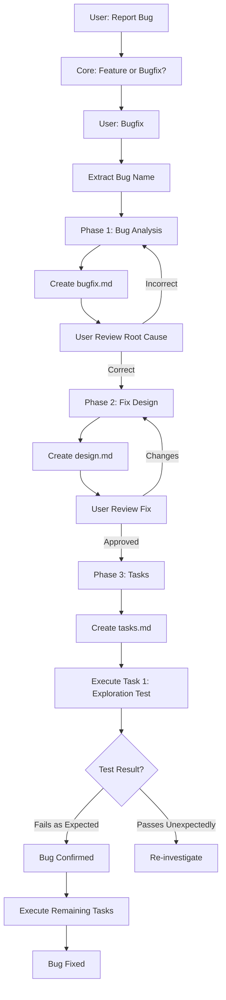
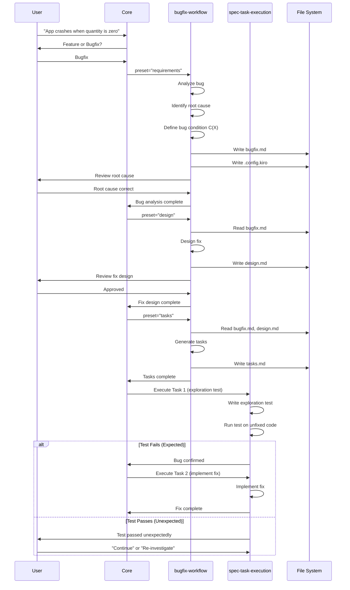
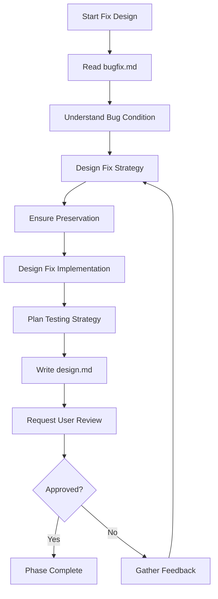
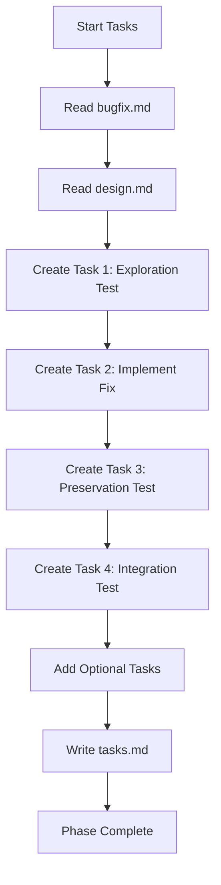
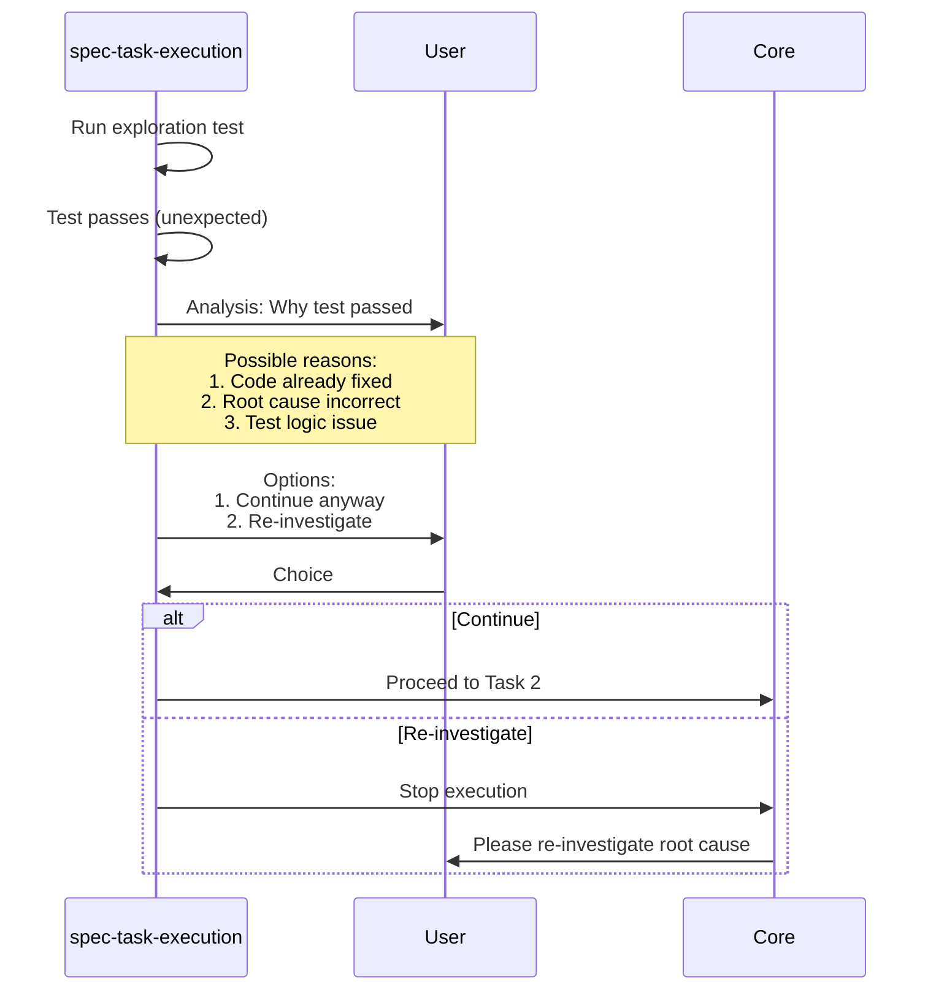
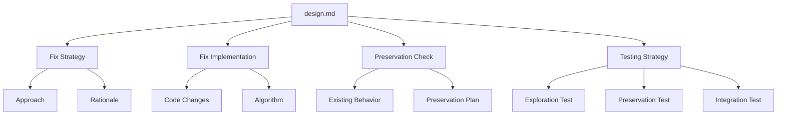
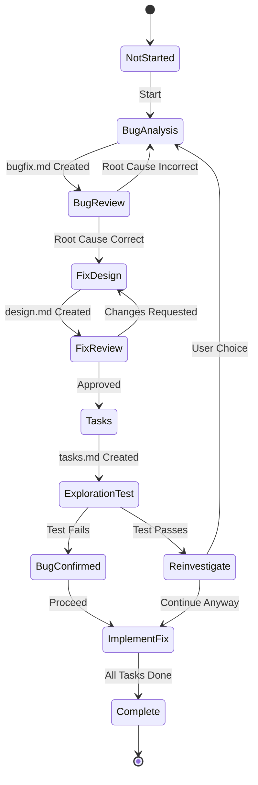
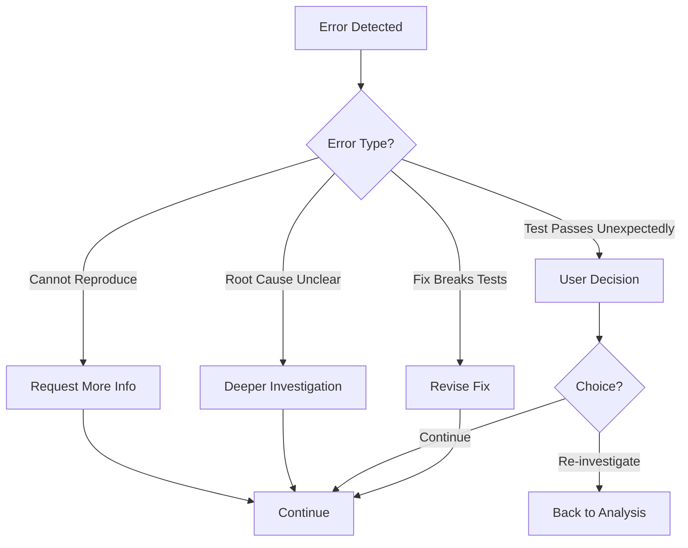

# Bugfix Workflow - Workflow Diagrams

## Overview

Агент для систематического исправления багов с использованием bug condition methodology.

---

## Main Workflow



---

## Phase Sequence



---

## Bug Analysis Phase

```mermaid
flowchart TD
    A[Start Bug Analysis] --> B[Gather Bug Information]
    B --> C[Reproduce Bug]
    C --> D{Reproduced?}
    D -->|No| E[Request More Info]
    E --> B
    D -->|Yes| F[Analyze Root Cause]
    F --> G[Identify Bug Condition C(X)]
    G --> H[Define Affected Code]
    H --> I[Assess Impact]
    I --> J[Write bugfix.md]
    J --> K[Request User Validation]
    K --> L{Root Cause Correct?}
    L -->|Yes| M[Phase Complete]
    L -->|No| N[Gather Feedback]
    N --> F
```

---

## Bug Condition Methodology

```mermaid
graph TB
    A[Bug Condition C(X)] --> B[Preconditions]
    A --> C[Trigger Conditions]
    A --> D[Expected Behavior]
    A --> E[Actual Behavior]
    
    B --> B1[System State]
    B --> B2[Input Constraints]
    
    C --> C1[User Action]
    C --> C2[System Event]
    
    D --> D1[Correct Output]
    D --> D2[Correct State]
    
    E --> E1[Buggy Output]
    E --> E2[Buggy State]
```

---

## Fix Design Phase



---

## Tasks Phase



---

## Exploration Test Execution

```mermaid
flowchart TD
    A[Execute Task 1] --> B[Write Exploration Test]
    B --> C[Test Checks Bug Condition C(X)]
    C --> D[Run Test on Unfixed Code]
    D --> E{Test Result?}
    
    E -->|Fails| F[Bug Confirmed]
    E -->|Passes| G[Unexpected Pass]
    
    F --> H[Document Counterexample]
    F --> I[Mark Task Complete]
    F --> J[Proceed to Task 2]
    
    G --> K[Analyze Why Test Passed]
    K --> L[Present Options to User]
    L --> M{User Choice?}
    M -->|Continue| J
    M -->|Re-investigate| N[Return to Bug Analysis]
```

---

## Unexpected Pass Handling



---

## Document Structure

### bugfix.md

```mermaid
graph TB
    A[bugfix.md] --> B[Bug Description]
    A --> C[Reproduction Steps]
    A --> D[Root Cause Analysis]
    A --> E[Bug Condition C(X)]
    A --> F[Affected Code]
    A --> G[Impact Assessment]
    
    D --> D1[Investigation Process]
    D --> D2[Root Cause]
    D --> D3[Why It Happens]
    
    E --> E1[Preconditions]
    E --> E2[Trigger]
    E --> E3[Expected vs Actual]
    
    F --> F1[Files]
    F --> F2[Functions]
    F --> F3[Lines]
```

### design.md (for bugfix)



### tasks.md (for bugfix)

```mermaid
graph TB
    A[tasks.md] --> B[Task 1: Exploration Test]
    A --> C[Task 2: Implement Fix]
    A --> D[Task 3: Preservation Test]
    A --> E[Task 4: Integration Test]
    A --> F[Optional Tasks]
    
    B --> B1[Write test for C(X)]
    B --> B2[Run on unfixed code]
    B --> B3[Confirm bug exists]
    
    C --> C1[Implement fix]
    C --> C2[Run exploration test]
    C --> C3[Verify fix works]
    
    D --> D1[Test existing behavior]
    D --> D2[Ensure no regression]
    
    E --> E1[Full integration test]
    E --> E2[Edge cases]
    
    style B fill:#FFB6C1
    style C fill:#90EE90
    style D fill:#90EE90
    style E fill:#90EE90
```

---

## State Management



---

## Error Handling



---

## Key Concepts

### Bug Condition C(X)

```
C(X) = {
  preconditions: [state before bug],
  trigger: [action that causes bug],
  expected: [correct behavior],
  actual: [buggy behavior]
}
```

### Preservation

```
Preservation = {
  existing_behavior: [what should not change],
  tests: [tests to verify preservation],
  validation: [how to check]
}
```

### Fix Checking

```
Fix Checking = {
  exploration_test: [confirms bug exists],
  fix_test: [confirms fix works],
  preservation_test: [confirms no regression]
}
```

---

## Key Features

1. **Systematic Approach**: Структурированный процесс исправления багов
2. **Bug Condition**: Формальное определение условий бага
3. **Exploration Test**: Тест, подтверждающий существование бага
4. **Preservation**: Проверка, что исправление не ломает существующую функциональность
5. **User Validation**: Подтверждение root cause перед исправлением

---

## Usage Example

```
User: "App crashes when quantity is zero"

Workflow:
1. Core asks: Feature or Bugfix? → Bugfix
2. Extract bug_name: "quantity-zero-crash"
3. Phase 1: Create bugfix.md
   - Reproduce bug
   - Root cause: Division by zero
   - Bug condition C(X)
4. User confirms root cause
5. Phase 2: Create design.md
   - Fix strategy: Add zero check
   - Preservation: Existing calculations
6. User approves fix design
7. Phase 3: Create tasks.md
   - Task 1: Exploration test
   - Task 2: Implement fix
   - Task 3: Preservation test
8. Execute Task 1:
   - Test fails (expected) → Bug confirmed
9. Execute remaining tasks
10. Bug fixed
```

---

## Best Practices

1. **Reproduce First**: Всегда воспроизводите баг перед анализом
2. **Clear Root Cause**: Определите точную причину бага
3. **Formal Bug Condition**: Используйте формальное определение C(X)
4. **Exploration Test**: Пишите тест, который подтверждает баг
5. **Preservation**: Проверяйте, что исправление не ломает существующую функциональность
6. **User Validation**: Получайте подтверждение root cause перед исправлением
