# Context Gatherer Agent - Workflow Diagrams

## Main Analysis Flow

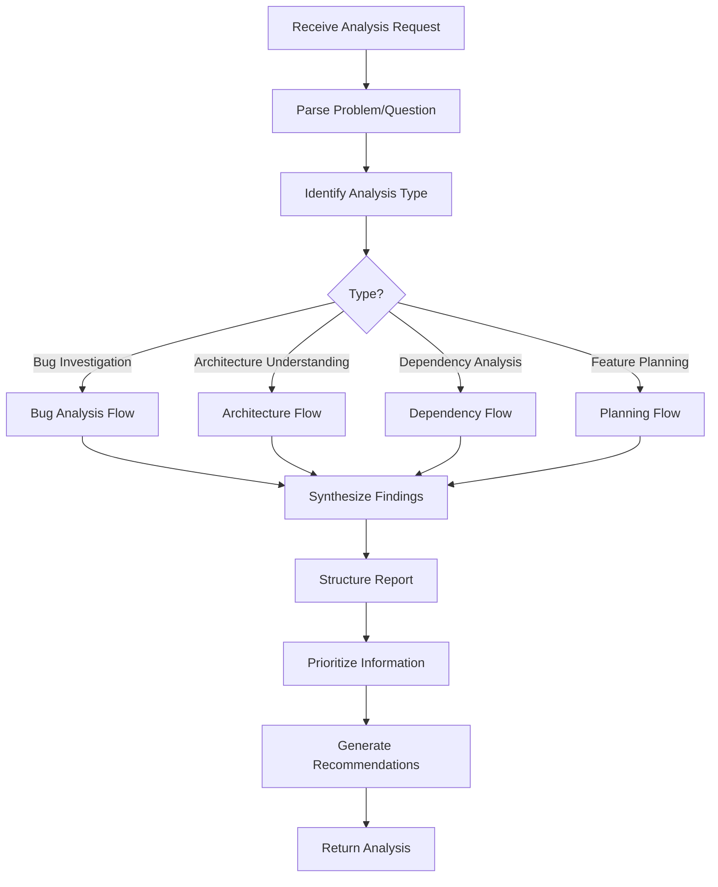

---

## Bug Investigation Flow

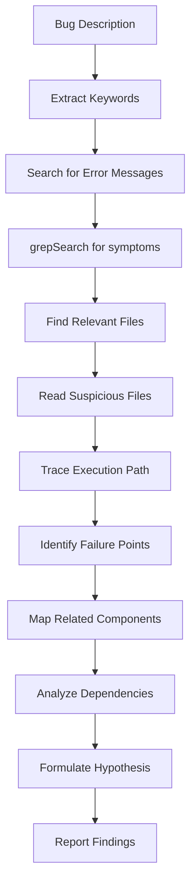

---

## Architecture Understanding Flow

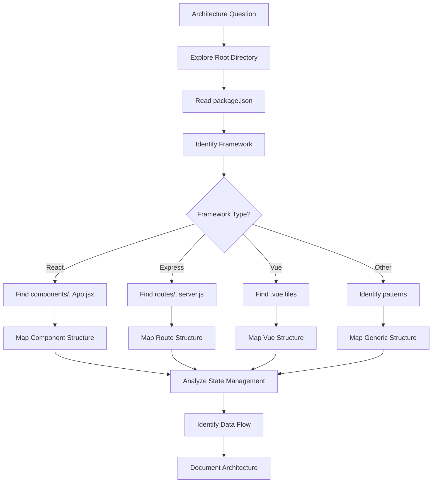

---

## Dependency Analysis Flow

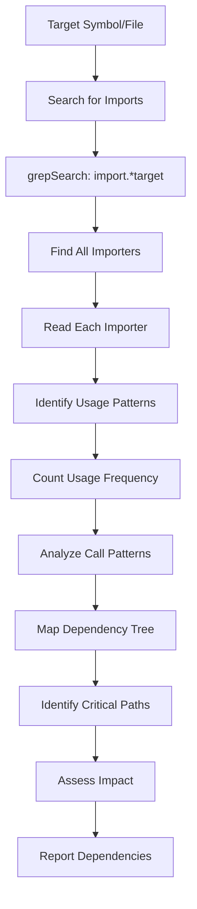

---

## Feature Planning Flow

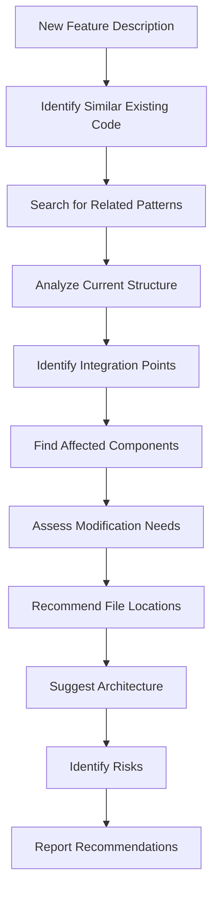

---

## Search Strategy Decision

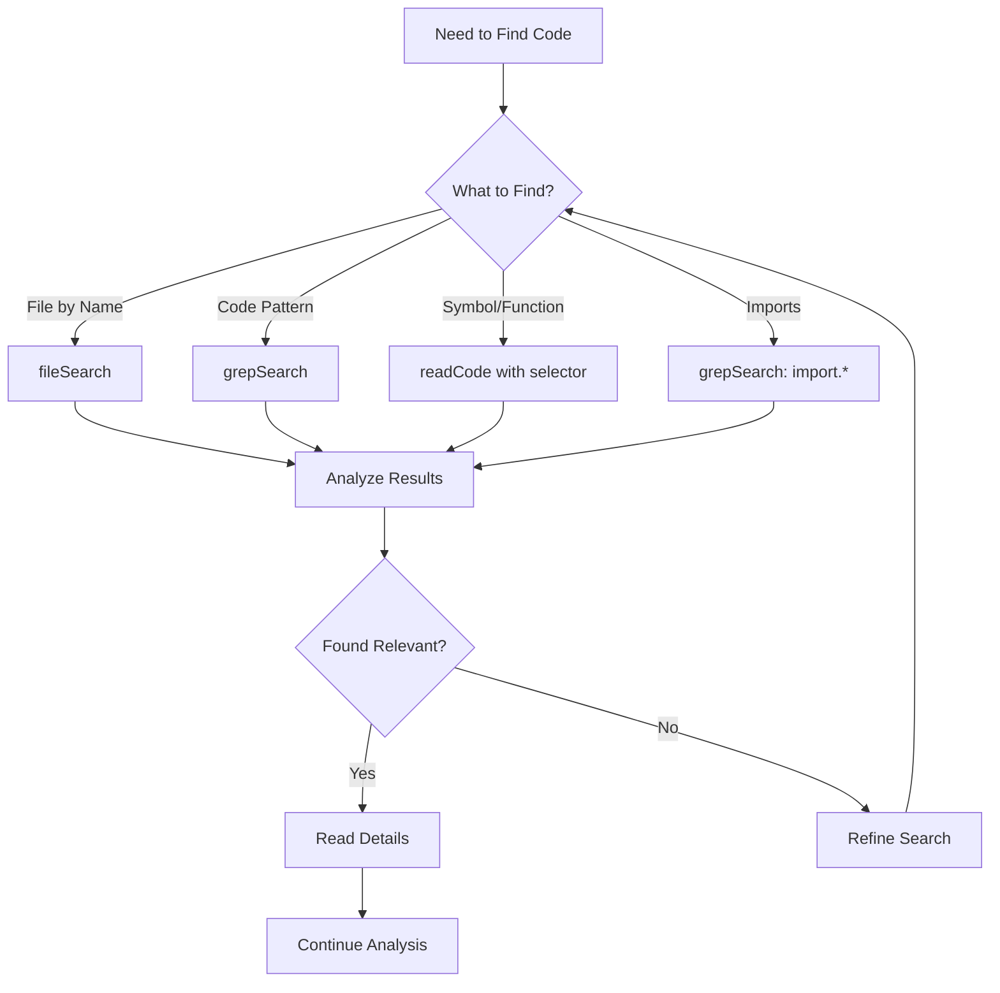

---

## Exploration Depth Strategy

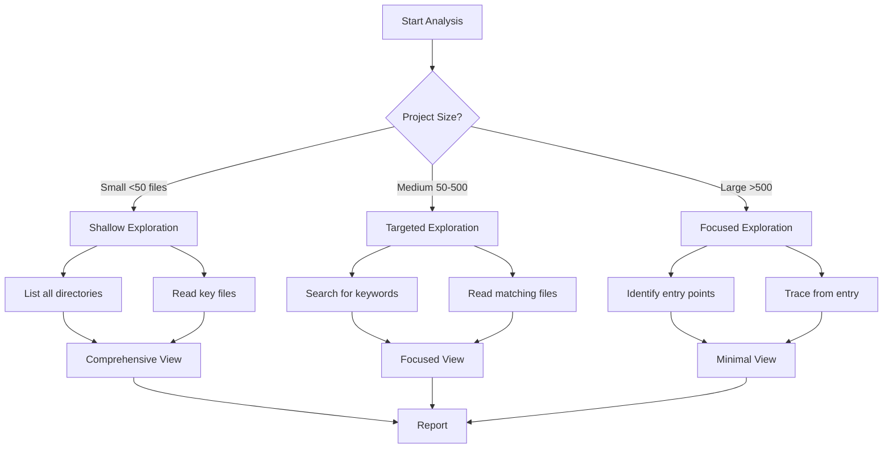

---

## File Relevance Scoring

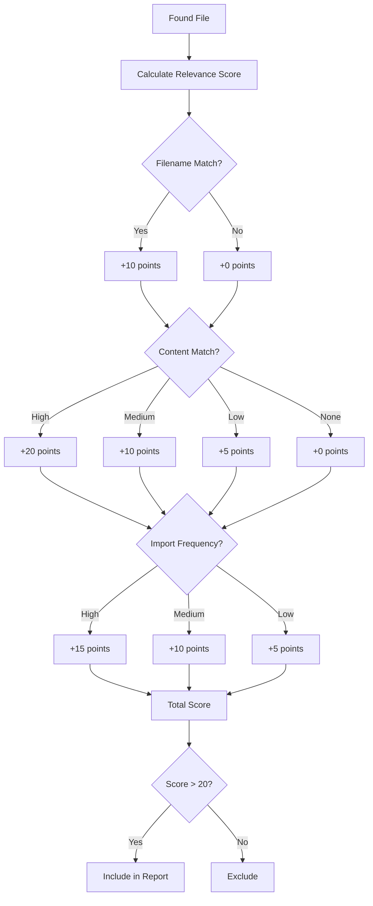

---

## Component Relationship Mapping

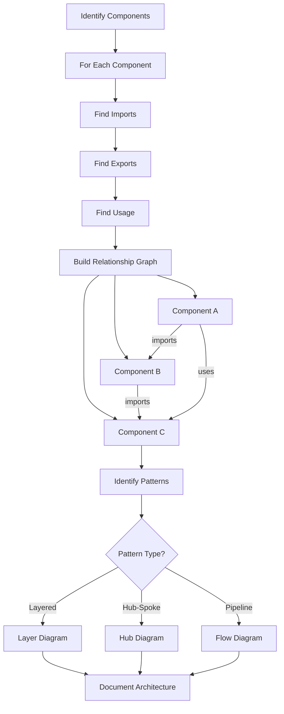

---

## Analysis Prioritization

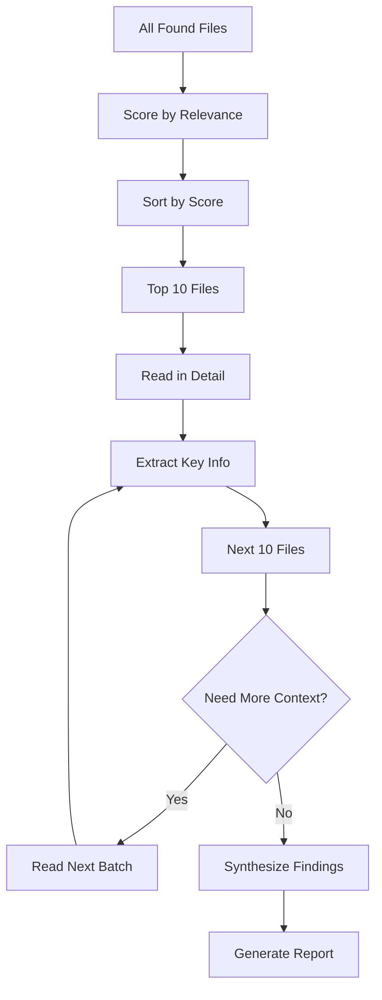

---

## Codebase Type Detection

```mermaid
flowchart TD
    A[Analyze Project] --> B[Read package.json]
    B --> C{Dependencies?}
    
    C -->|react| D[React Application]
    C -->|express| E[Express Backend]
    C -->|vue| F[Vue Application]
    C -->|@angular| G[Angular Application]
    C -->|next| H[Next.js Application]
    
    D --> I[Check for Redux/MobX]
    E --> J[Check for ORM]
    F --> K[Check for Vuex]
    G --> L[Check for NgRx]
    H --> M[Check for API routes]
    
    I --> N[Document Stack]
    J --> N
    K --> N
    L --> N
    M --> N
    
    N --> O[Adapt Analysis Strategy]
```

---

## Report Generation Flow

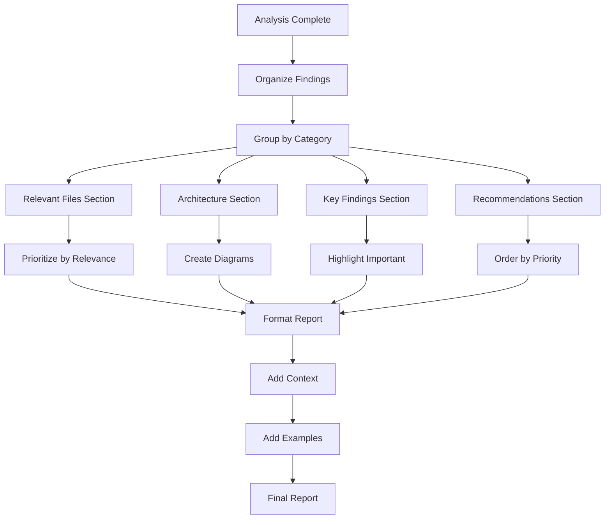

---

## Interaction with Other Agents

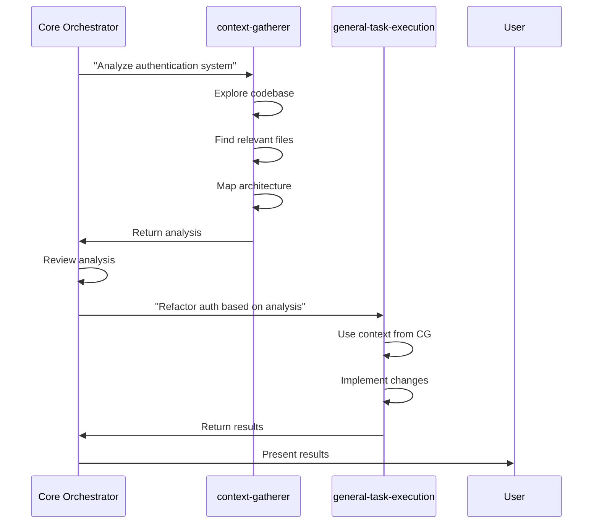

---

## Efficiency Optimization

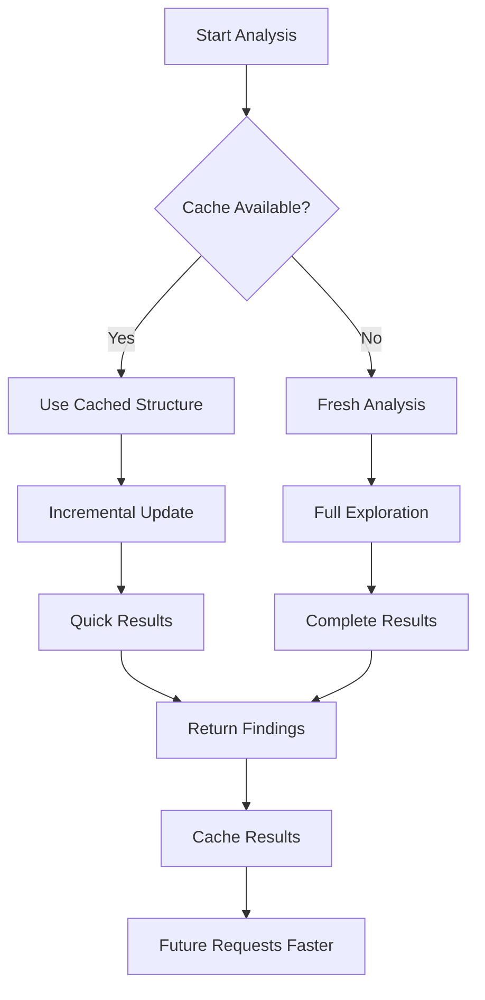

---

## Analysis Patterns

### Pattern 1: Top-Down

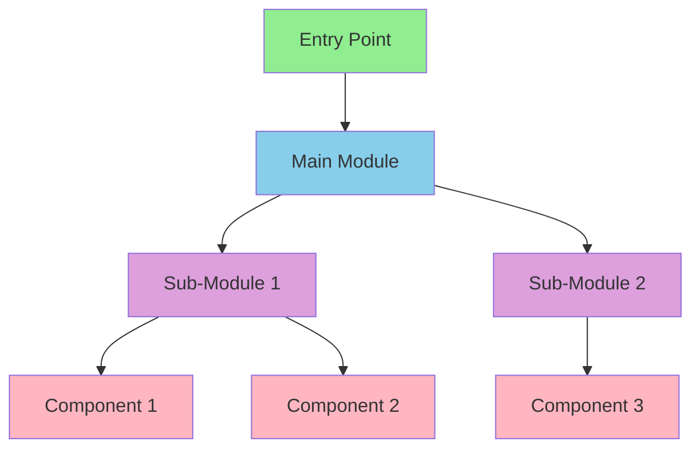

### Pattern 2: Bottom-Up

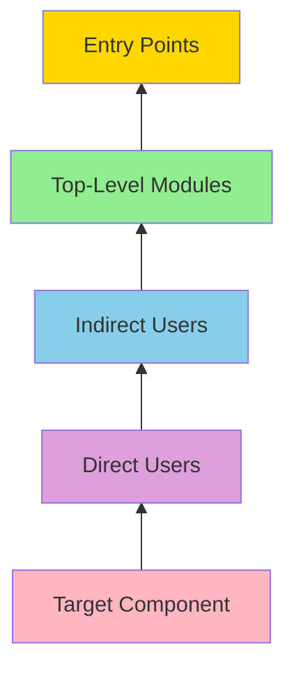

---

## Real-World Scenario: Performance Issue

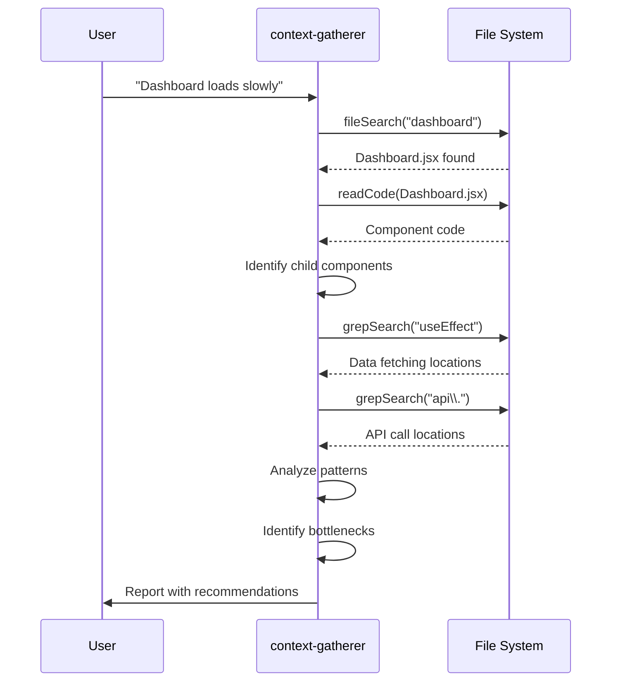

---

## Analysis Output Structure

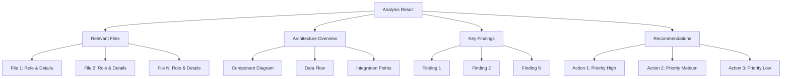
