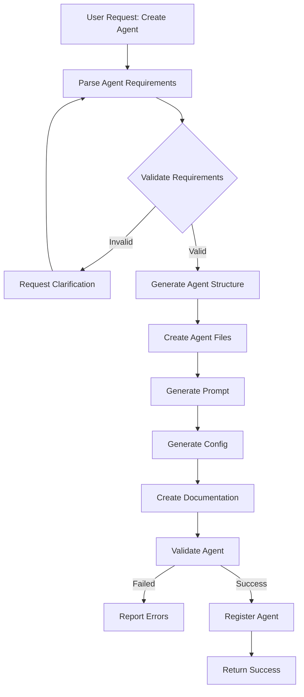
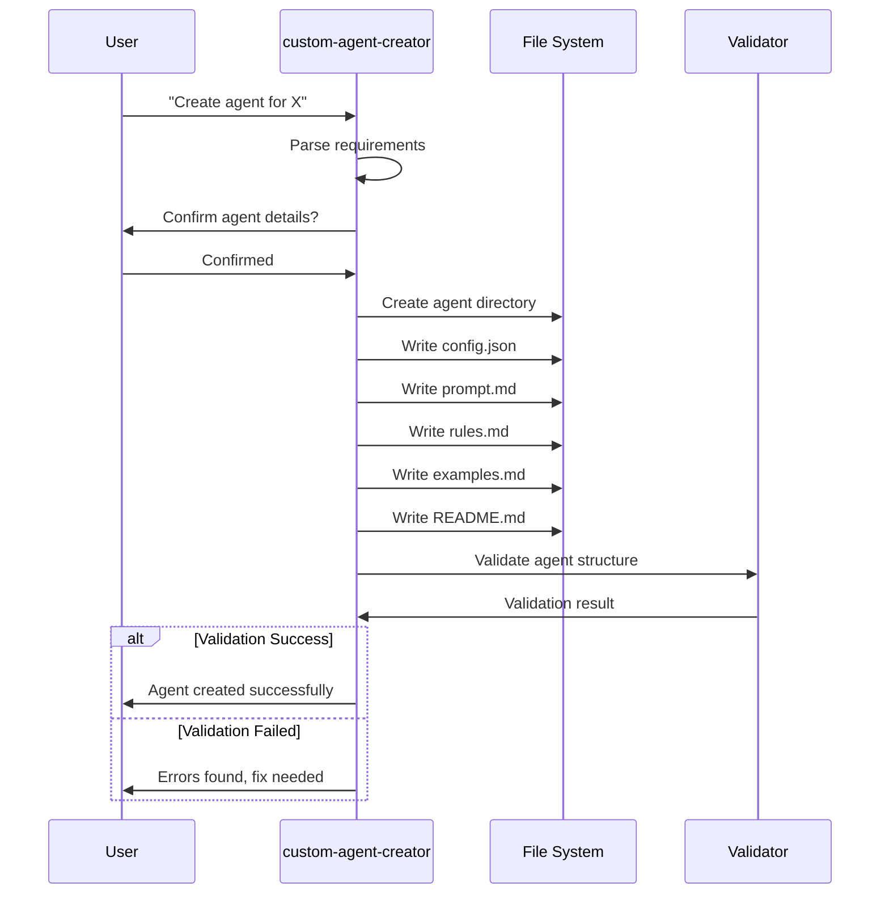
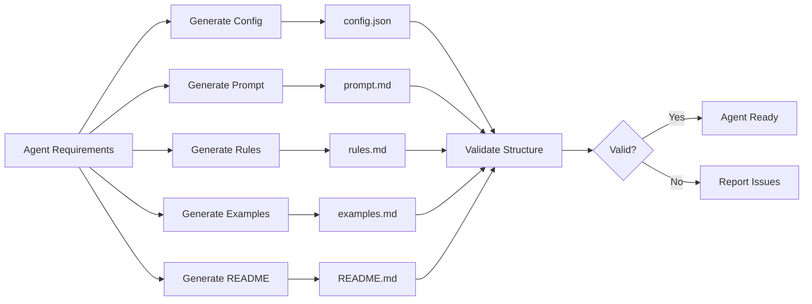
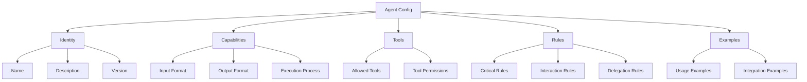
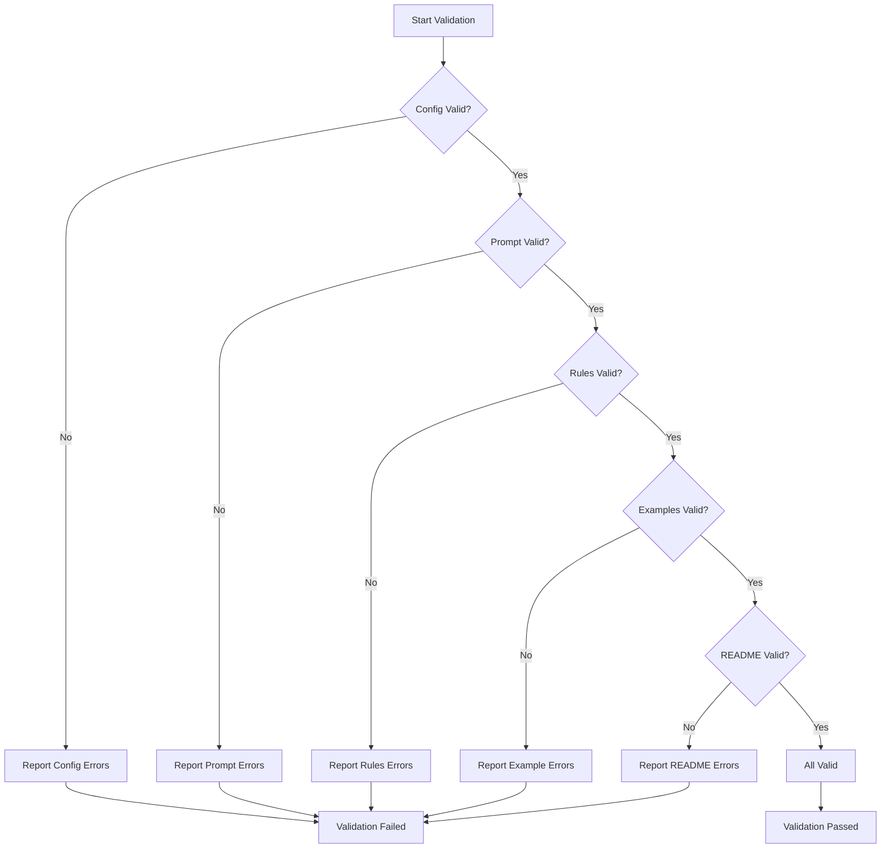
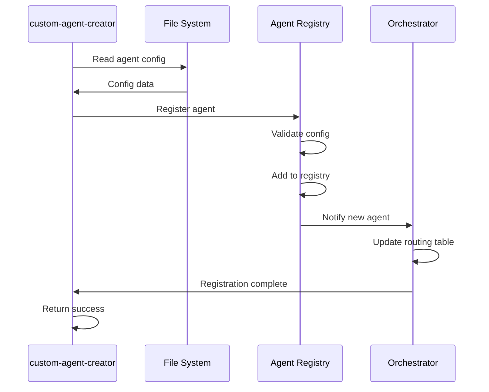
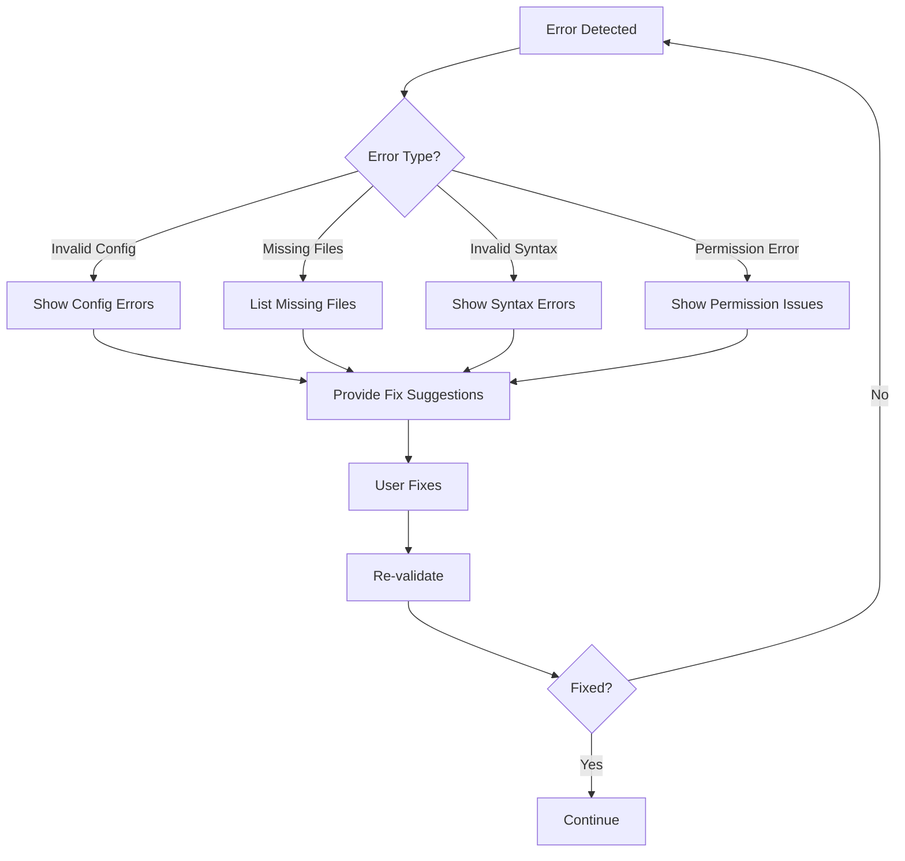

# Custom Agent Creator - Workflow Diagrams

## Overview

Агент для создания новых пользовательских агентов в системе Kiro.

---

## Main Workflow



---

## Agent Creation Process



---

## File Generation Flow



---

## Agent Configuration Structure



---

## Validation Process



---

## Agent Registration Flow



---

## Error Handling



---

## Agent Template Structure

```
.kiro/agents/{agent-name}/
├── config.json          # Agent configuration
├── prompt.md            # System prompt
├── rules.md             # Detailed rules
├── examples.md          # Usage examples
└── README.md            # Documentation
```

---

## Key Features

1. **Automated Generation**: Создает все необходимые файлы автоматически
2. **Validation**: Проверяет корректность структуры агента
3. **Templates**: Использует шаблоны для генерации
4. **Documentation**: Автоматически создает документацию
5. **Registration**: Регистрирует агента в системе

---

## Usage Example

```
User: "Create an agent that analyzes code complexity"

Agent:
1. Parses requirement
2. Generates agent structure:
   - Name: code-complexity-analyzer
   - Tools: readFile, readCode, grepSearch
   - Capabilities: AST analysis, metrics calculation
3. Creates all files
4. Validates structure
5. Registers agent
6. Returns success
```

---

## Integration Points

### Input
- Agent requirements (name, purpose, capabilities)
- Tool requirements
- Example use cases

### Output
- Complete agent directory structure
- All configuration files
- Documentation
- Registration confirmation

### Dependencies
- File system access
- Template engine
- Validator
- Agent registry
