# Feature Design-First Workflow - Workflow Diagrams

## Overview

Агент для создания спецификаций новых функций, начиная с технического дизайна.

---

## Main Workflow

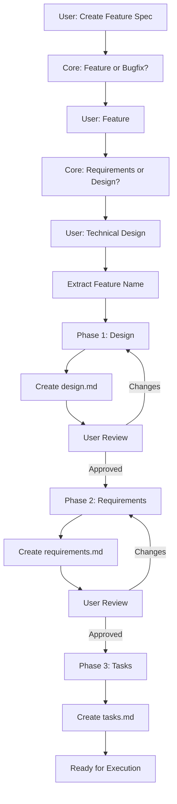

---

## Phase Sequence

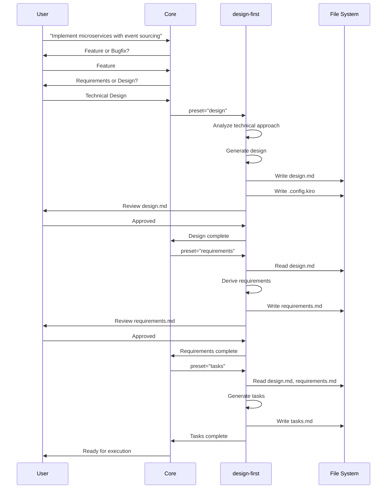

---

## Design Phase (First)

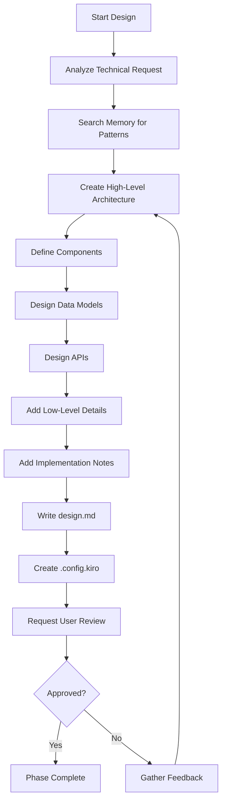

---

## Requirements Phase (Second)

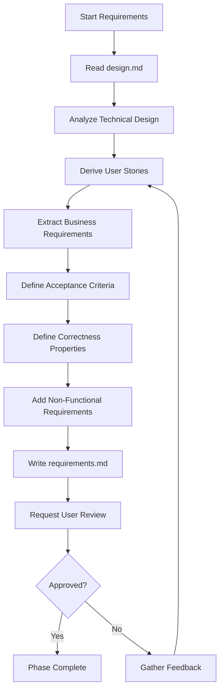

---

## Tasks Phase (Third)

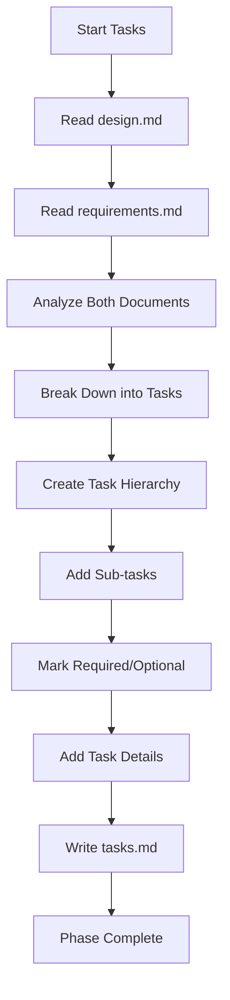

---

## Document Structure

### design.md (Created First)

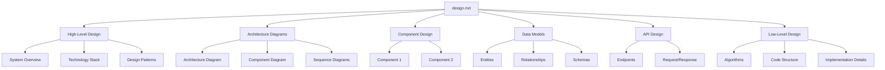

### requirements.md (Derived from Design)

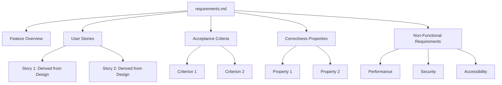

---

## State Management

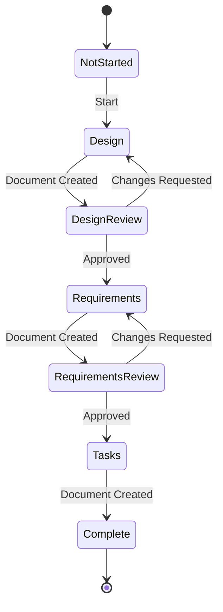

---

## Design-First vs Requirements-First

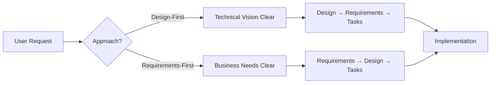

---

## When to Use Design-First

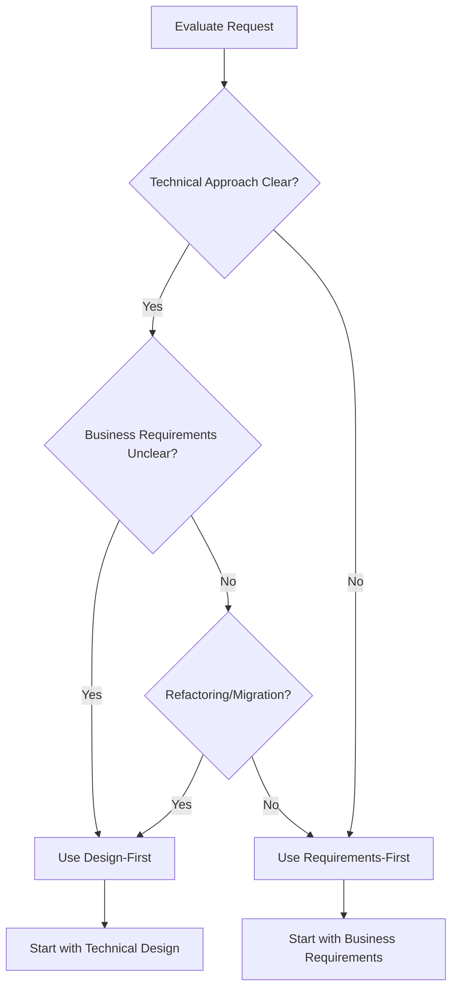

---

## Requirements Derivation Process

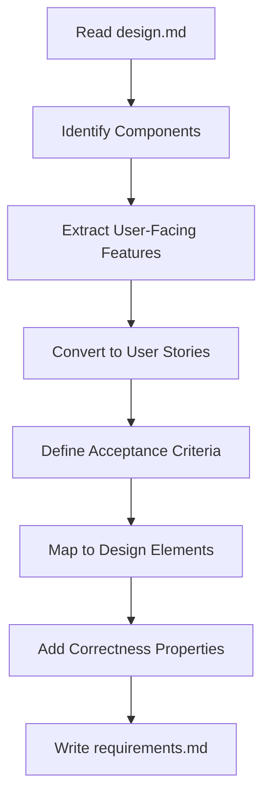

---

## Error Handling

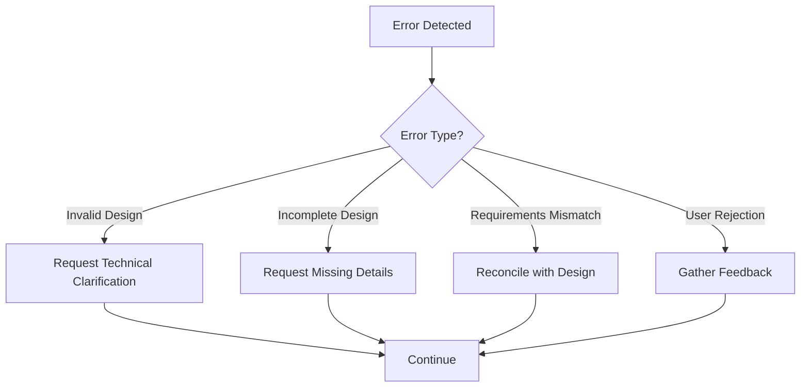

---

## Integration with Task Execution

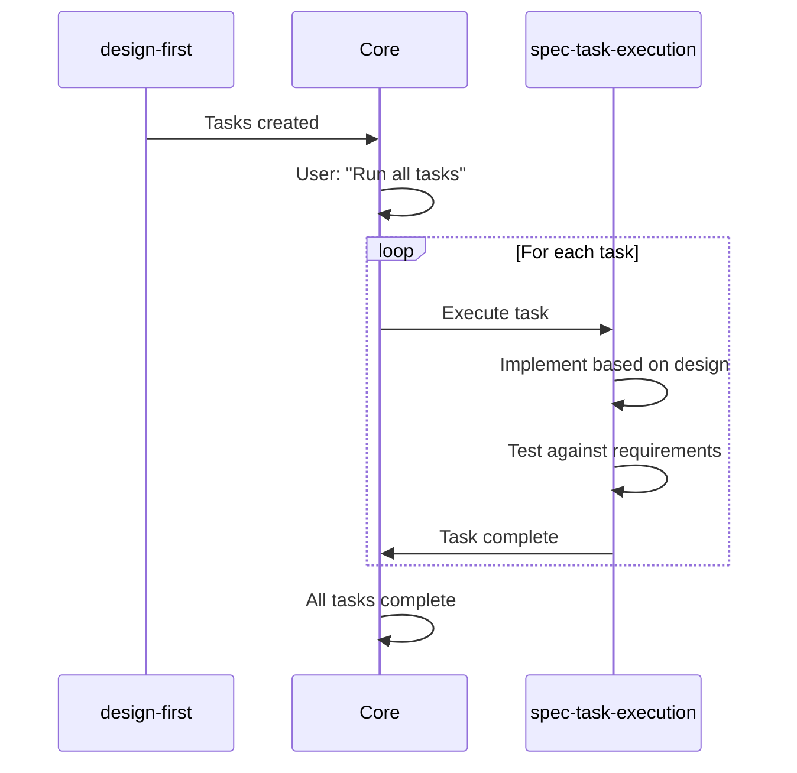

---

## Key Features

1. **Design-Driven**: Начинает с технического решения
2. **Requirements Derivation**: Автоматически выводит требования из дизайна
3. **User Approval**: Требует подтверждения на каждом этапе
4. **Iterative**: Позволяет вносить изменения
5. **Consistency**: Обеспечивает согласованность дизайна и требований

---

## Usage Example

```
User: "Implement microservices architecture with event sourcing"

Workflow:
1. Core asks: Feature or Bugfix? → Feature
2. Core asks: Requirements or Design? → Technical Design
3. Extract feature_name: "microservices-event-sourcing"
4. Phase 1: Create design.md
   - Architecture diagrams
   - Component design
   - Event sourcing patterns
   - API design
5. User reviews and approves
6. Phase 2: Create requirements.md (derived from design)
   - User stories based on components
   - Acceptance criteria from design
   - Correctness properties
7. User reviews and approves
8. Phase 3: Create tasks.md
   - Implementation tasks
   - Testing tasks
9. Ready for execution
```

---

## Best Practices

1. **Clear Technical Vision**: Убедитесь, что технический подход понятен
2. **Complete Design**: Включайте все архитектурные детали
3. **Derive Requirements**: Выводите требования из дизайна, не изобретайте заново
4. **Consistency Check**: Проверяйте согласованность дизайна и требований
5. **User Validation**: Получайте подтверждение на каждом этапе

---

## Comparison with Requirements-First

| Aspect | Design-First | Requirements-First |
|--------|--------------|-------------------|
| Start Point | Technical design | Business requirements |
| Best For | Technical refactoring, migrations | New features, user-facing |
| First Document | design.md | requirements.md |
| Requirements | Derived from design | Drive the design |
| Use Case | Clear technical approach | Clear business needs |
