# Feature Requirements-First Workflow - Workflow Diagrams

## Overview

Агент для создания спецификаций новых функций, начиная с требований.

---

## Main Workflow

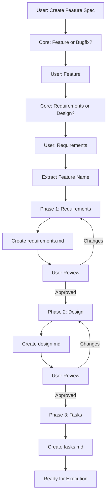

---

## Phase Sequence

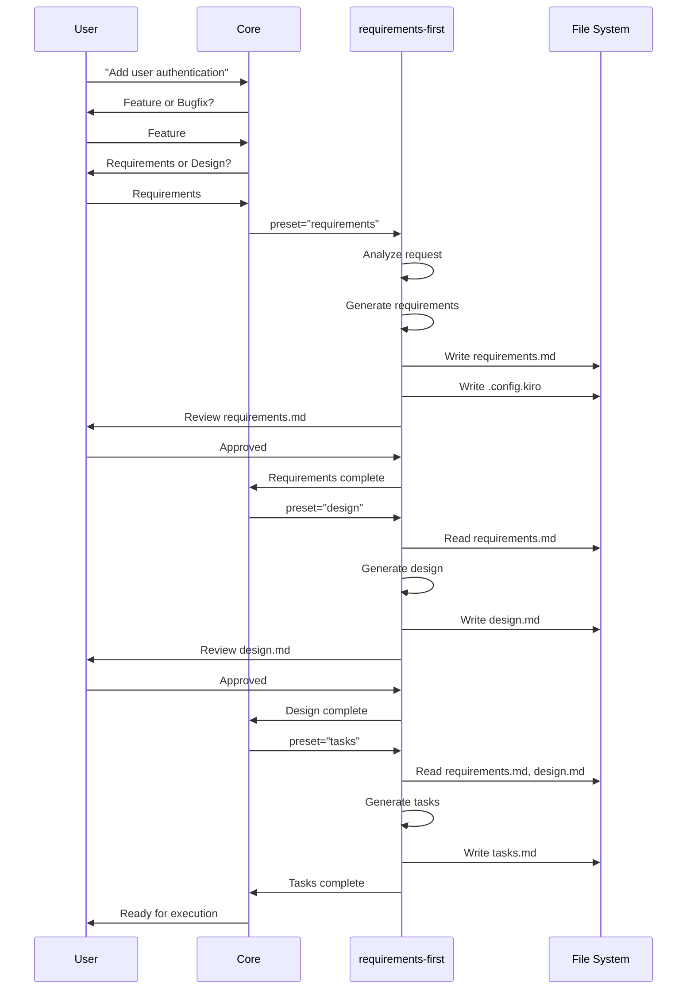

---

## Requirements Phase

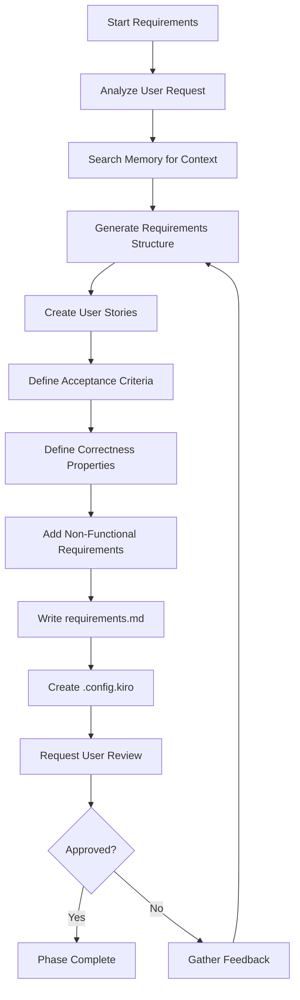

---

## Design Phase

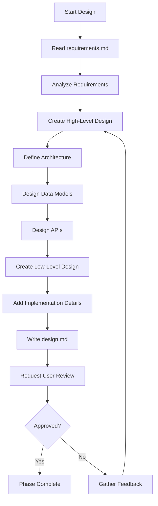

---

## Tasks Phase

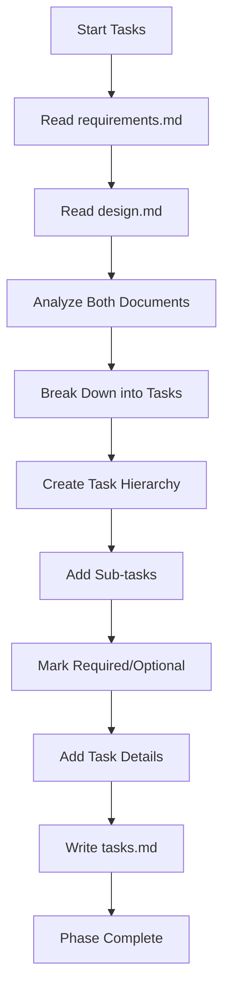

---

## Document Structure

### requirements.md

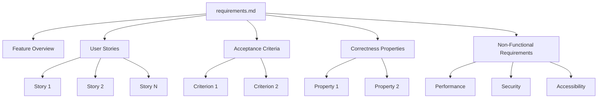

### design.md

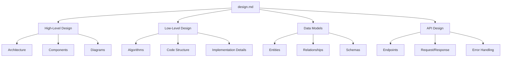

### tasks.md

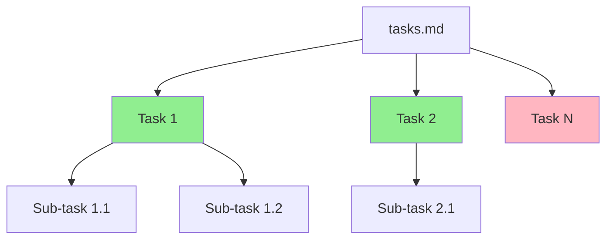

---

## State Management

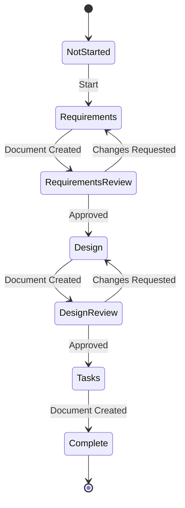

---

## Error Handling

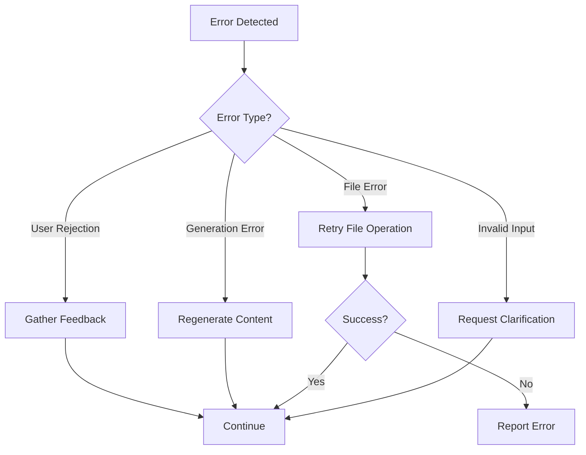

---

## File System Operations

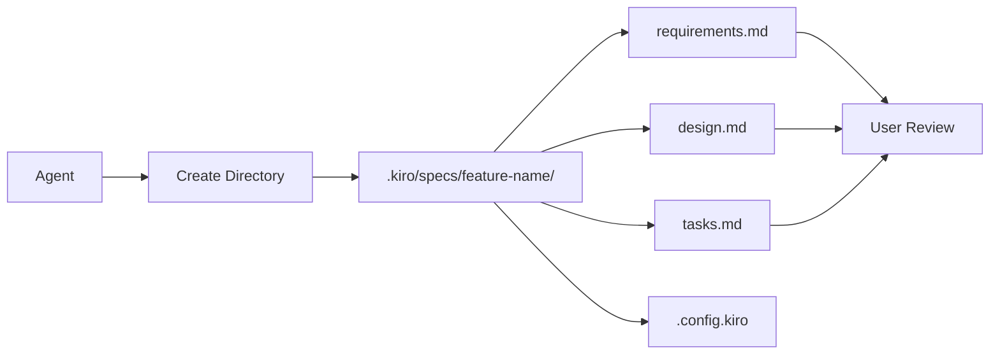

---

## Integration with Task Execution

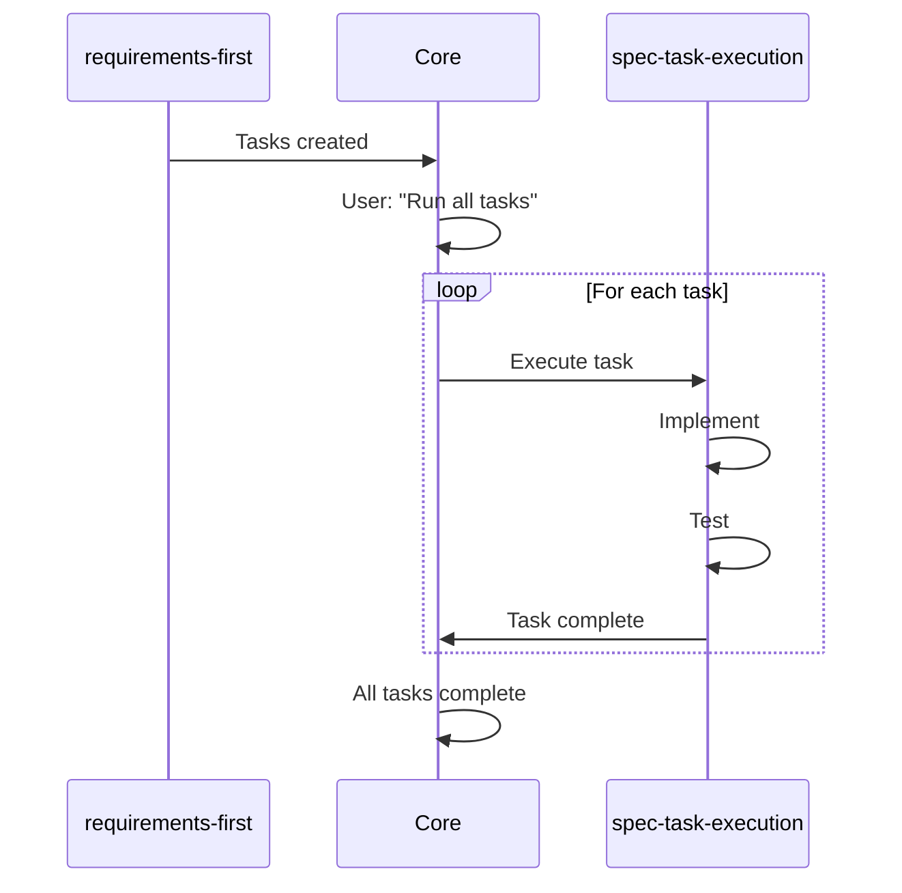

---

## Key Features

1. **Requirements-Driven**: Начинает с бизнес-требований
2. **User Approval**: Требует подтверждения на каждом этапе
3. **Iterative**: Позволяет вносить изменения
4. **Structured**: Создает четкую структуру документов
5. **Property-Based**: Включает correctness properties для тестирования

---

## Usage Example

```
User: "I want to add user authentication"

Workflow:
1. Core asks: Feature or Bugfix? → Feature
2. Core asks: Requirements or Design? → Requirements
3. Extract feature_name: "user-authentication"
4. Phase 1: Create requirements.md
   - User stories
   - Acceptance criteria
   - Correctness properties
5. User reviews and approves
6. Phase 2: Create design.md
   - Architecture
   - Data models
   - API design
7. User reviews and approves
8. Phase 3: Create tasks.md
   - Implementation tasks
   - Testing tasks
9. Ready for execution
```

---

## Best Practices

1. **Clear Requirements**: Убедитесь, что требования понятны
2. **User Involvement**: Получайте обратную связь на каждом этапе
3. **Completeness**: Включайте все необходимые детали
4. **Testability**: Определяйте correctness properties
5. **Maintainability**: Структурируйте документы для легкого обновления
