# General Task Execution Agent - Workflow Diagrams

## Основной поток выполнения

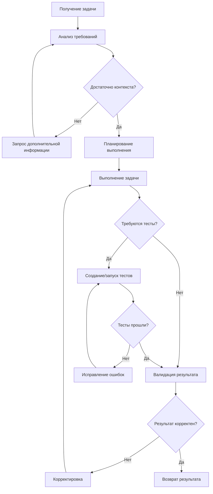
```mermaid
flowchart TD
    A[Получение задачи] --> B[Анализ требований]
    B --> C{Достаточно контекста?}
    C -->|Нет| D[Запрос дополнительной информации]
    D --> B
    C -->|Да| E[Планирование выполнения]
    E --> F[Выполнение задачи]
    F --> G{Требуются тесты?}
    G -->|Да| H[Создание/запуск тестов]
    G -->|Нет| I[Валидация результата]
    H --> J{Тесты прошли?}
    J -->|Нет| K[Исправление ошибок]
    K --> H
    J -->|Да| I
    I --> L{Результат корректен?}
    L -->|Нет| M[Корректировка]
    M --> F
    L -->|Да| N[Возврат результата]
```

---

## Поток создания файла

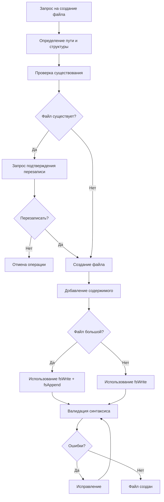
```mermaid
flowchart TD
    A[Запрос на создание файла] --> B[Определение пути и структуры]
    B --> C[Проверка существования]
    C --> D{Файл существует?}
    D -->|Да| E[Запрос подтверждения перезаписи]
    E --> F{Перезаписать?}
    F -->|Нет| G[Отмена операции]
    F -->|Да| H[Создание файла]
    D -->|Нет| H
    H --> I[Добавление содержимого]
    I --> J{Файл большой?}
    J -->|Да| K[Использование fsWrite + fsAppend]
    J -->|Нет| L[Использование fsWrite]
    K --> M[Валидация синтаксиса]
    L --> M
    M --> N{Ошибки?}
    N -->|Да| O[Исправление]
    O --> M
    N -->|Нет| P[Файл создан]
```

---

## Поток модификации кода

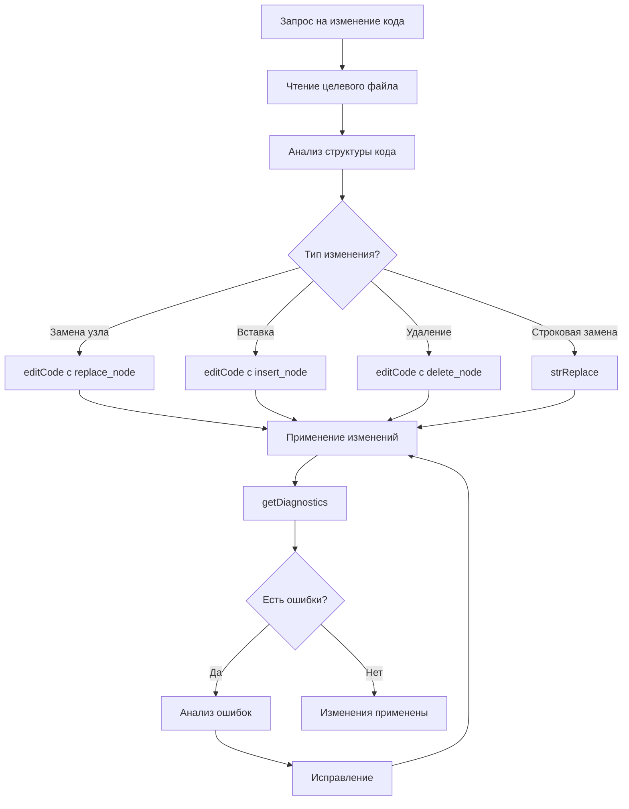
```mermaid
flowchart TD
    A[Запрос на изменение кода] --> B[Чтение целевого файла]
    B --> C[Анализ структуры кода]
    C --> D{Тип изменения?}
    D -->|Замена узла| E[editCode с replace_node]
    D -->|Вставка| F[editCode с insert_node]
    D -->|Удаление| G[editCode с delete_node]
    D -->|Строковая замена| H[strReplace]
    E --> I[Применение изменений]
    F --> I
    G --> I
    H --> I
    I --> J[getDiagnostics]
    J --> K{Есть ошибки?}
    K -->|Да| L[Анализ ошибок]
    L --> M[Исправление]
    M --> I
    K -->|Нет| N[Изменения применены]
```

---

## Поток рефакторинга

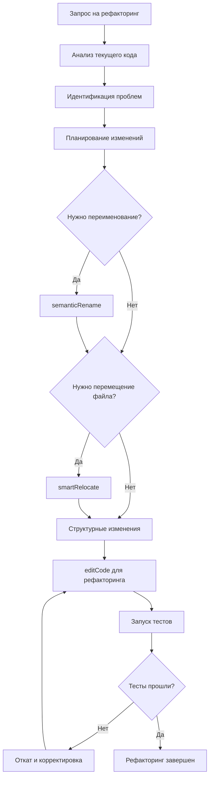
```mermaid
flowchart TD
    A[Запрос на рефакторинг] --> B[Анализ текущего кода]
    B --> C[Идентификация проблем]
    C --> D[Планирование изменений]
    D --> E{Нужно переименование?}
    E -->|Да| F[semanticRename]
    E -->|Нет| G{Нужно перемещение файла?}
    F --> G
    G -->|Да| H[smartRelocate]
    G -->|Нет| I[Структурные изменения]
    H --> I
    I --> J[editCode для рефакторинга]
    J --> K[Запуск тестов]
    K --> L{Тесты прошли?}
    L -->|Нет| M[Откат и корректировка]
    M --> J
    L -->|Да| N[Рефакторинг завершен]
```

---

## Поток установки зависимостей

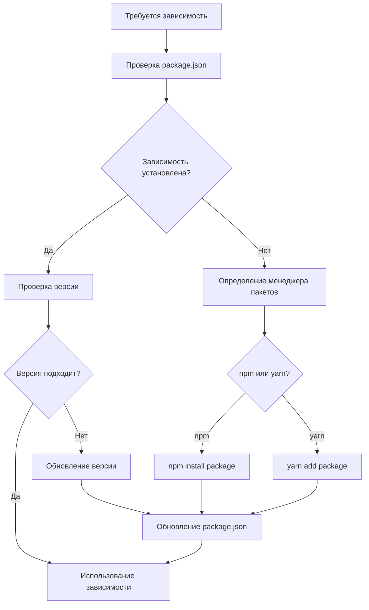
```mermaid
flowchart TD
    A[Требуется зависимость] --> B[Проверка package.json]
    B --> C{Зависимость установлена?}
    C -->|Да| D[Проверка версии]
    D --> E{Версия подходит?}
    E -->|Да| F[Использование зависимости]
    E -->|Нет| G[Обновление версии]
    C -->|Нет| H[Определение менеджера пакетов]
    H --> I{npm или yarn?}
    I -->|npm| J[npm install package]
    I -->|yarn| K[yarn add package]
    J --> L[Обновление package.json]
    K --> L
    G --> L
    L --> F
```

---

## Поток обработки ошибок

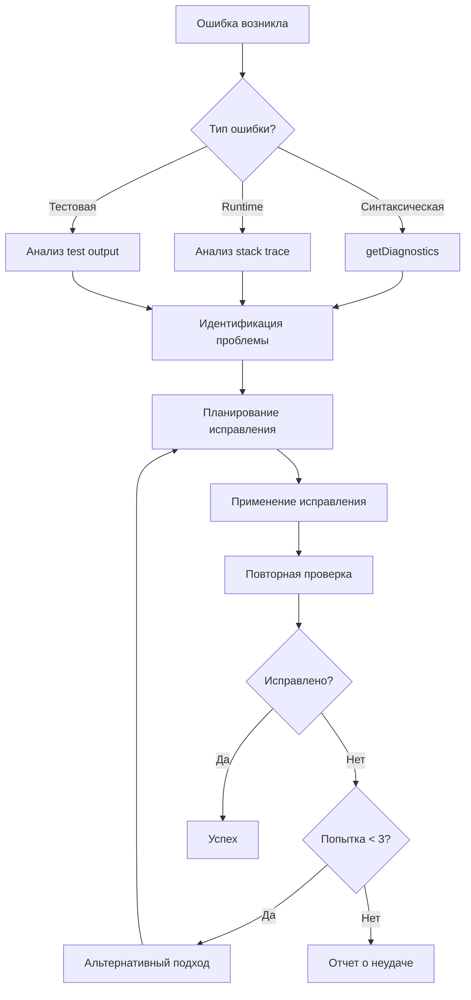
```mermaid
flowchart TD
    A[Ошибка возникла] --> B{Тип ошибки?}
    B -->|Синтаксическая| C[getDiagnostics]
    B -->|Runtime| D[Анализ stack trace]
    B -->|Тестовая| E[Анализ test output]
    C --> F[Идентификация проблемы]
    D --> F
    E --> F
    F --> G[Планирование исправления]
    G --> H[Применение исправления]
    H --> I[Повторная проверка]
    I --> J{Исправлено?}
    J -->|Нет| K{Попытка < 3?}
    K -->|Да| L[Альтернативный подход]
    L --> G
    K -->|Нет| M[Отчет о неудаче]
    J -->|Да| N[Успех]
```

---

## Поток работы с тестами

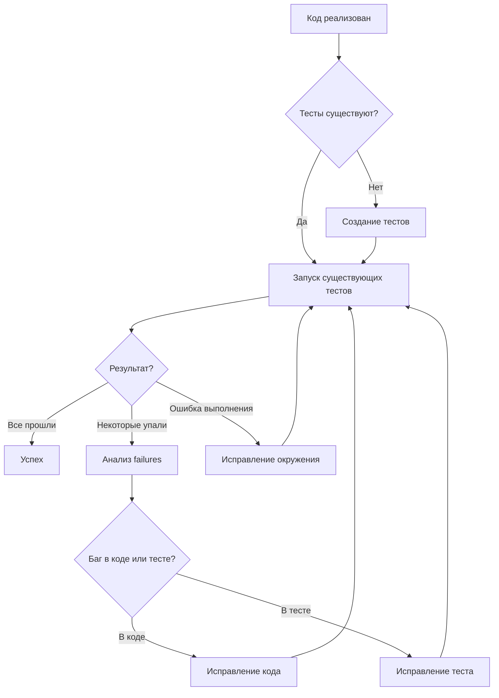
```mermaid
flowchart TD
    A[Код реализован] --> B{Тесты существуют?}
    B -->|Нет| C[Создание тестов]
    B -->|Да| D[Запуск существующих тестов]
    C --> D
    D --> E{Результат?}
    E -->|Все прошли| F[Успех]
    E -->|Некоторые упали| G[Анализ failures]
    G --> H{Баг в коде или тесте?}
    H -->|В коде| I[Исправление кода]
    H -->|В тесте| J[Исправление теста]
    I --> D
    J --> D
    E -->|Ошибка выполнения| K[Исправление окружения]
    K --> D
```

---

## Поток конфигурации

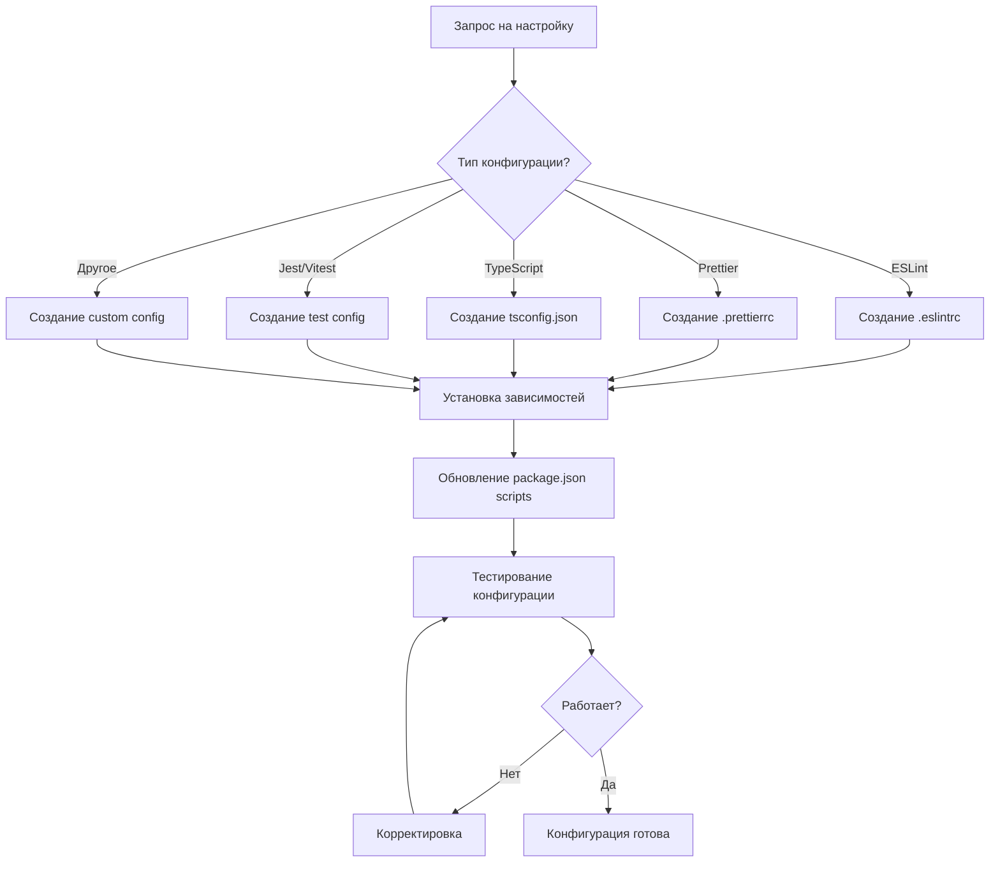
```mermaid
flowchart TD
    A[Запрос на настройку] --> B{Тип конфигурации?}
    B -->|ESLint| C[Создание .eslintrc]
    B -->|Prettier| D[Создание .prettierrc]
    B -->|TypeScript| E[Создание tsconfig.json]
    B -->|Jest/Vitest| F[Создание test config]
    B -->|Другое| G[Создание custom config]
    C --> H[Установка зависимостей]
    D --> H
    E --> H
    F --> H
    G --> H
    H --> I[Обновление package.json scripts]
    I --> J[Тестирование конфигурации]
    J --> K{Работает?}
    K -->|Нет| L[Корректировка]
    L --> J
    K -->|Да| M[Конфигурация готова]
```

---

## Параллельное выполнение

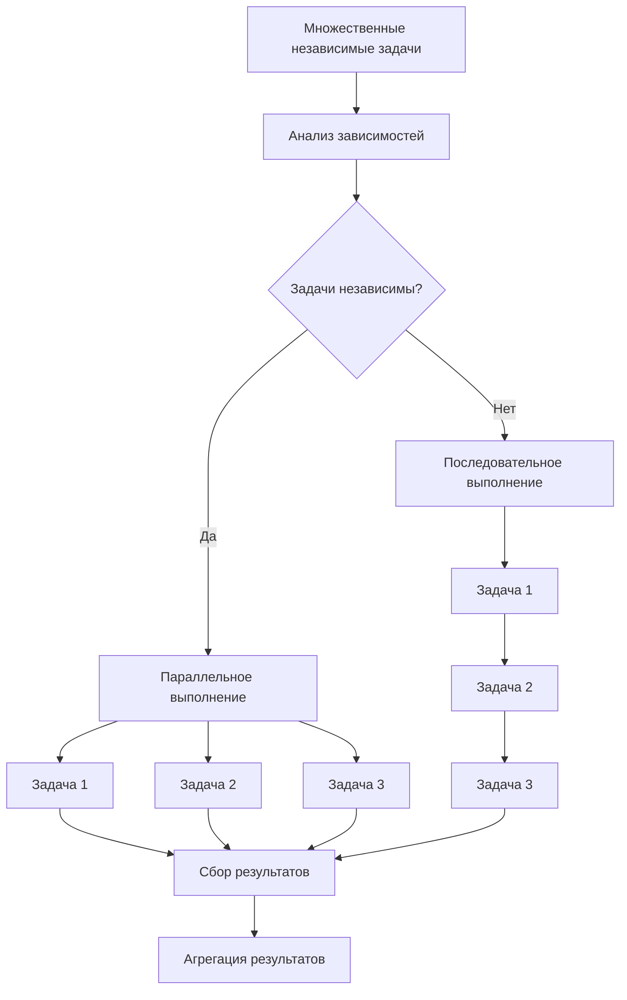
```mermaid
flowchart TD
    A[Множественные независимые задачи] --> B[Анализ зависимостей]
    B --> C{Задачи независимы?}
    C -->|Да| D[Параллельное выполнение]
    C -->|Нет| E[Последовательное выполнение]
    D --> F[Задача 1]
    D --> G[Задача 2]
    D --> H[Задача 3]
    F --> I[Сбор результатов]
    G --> I
    H --> I
    E --> J[Задача 1]
    J --> K[Задача 2]
    K --> L[Задача 3]
    L --> I
    I --> M[Агрегация результатов]
```

---

## Интеграция с Git

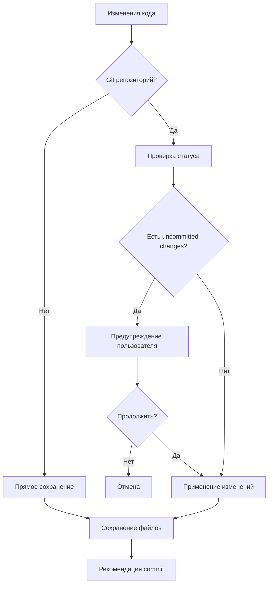
```mermaid
flowchart TD
    A[Изменения кода] --> B{Git репозиторий?}
    B -->|Нет| C[Прямое сохранение]
    B -->|Да| D[Проверка статуса]
    D --> E{Есть uncommitted changes?}
    E -->|Да| F[Предупреждение пользователя]
    E -->|Нет| G[Применение изменений]
    F --> H{Продолжить?}
    H -->|Нет| I[Отмена]
    H -->|Да| G
    G --> J[Сохранение файлов]
    C --> J
    J --> K[Рекомендация commit]
```

---

## Жизненный цикл задачи

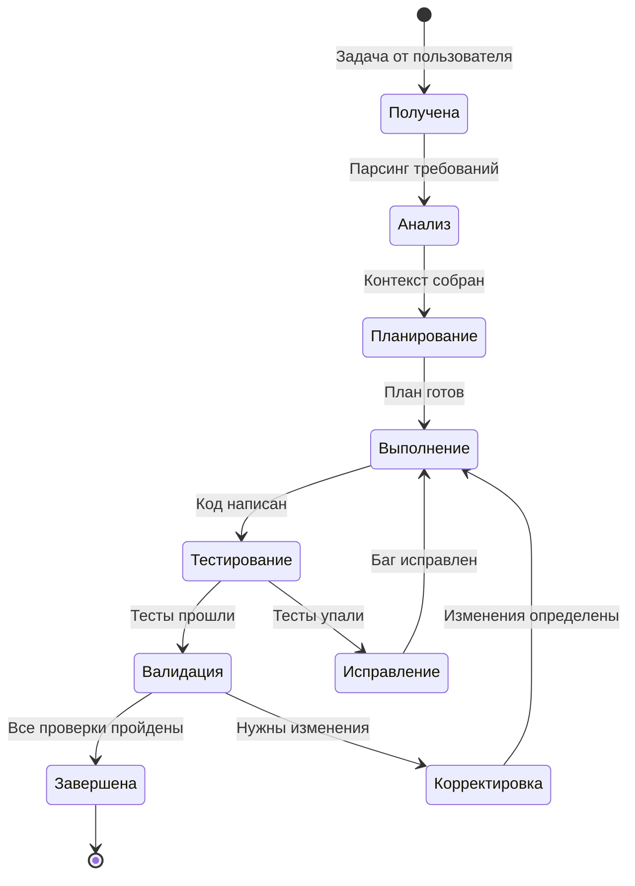
```mermaid
stateDiagram-v2
    [*] --> Получена: Задача от пользователя
    Получена --> Анализ: Парсинг требований
    Анализ --> Планирование: Контекст собран
    Планирование --> Выполнение: План готов
    Выполнение --> Тестирование: Код написан
    Тестирование --> Валидация: Тесты прошли
    Тестирование --> Исправление: Тесты упали
    Исправление --> Выполнение: Баг исправлен
    Валидация --> Завершена: Все проверки пройдены
    Валидация --> Корректировка: Нужны изменения
    Корректировка --> Выполнение: Изменения определены
    Завершена --> [*]
```

---

## Принятие решений

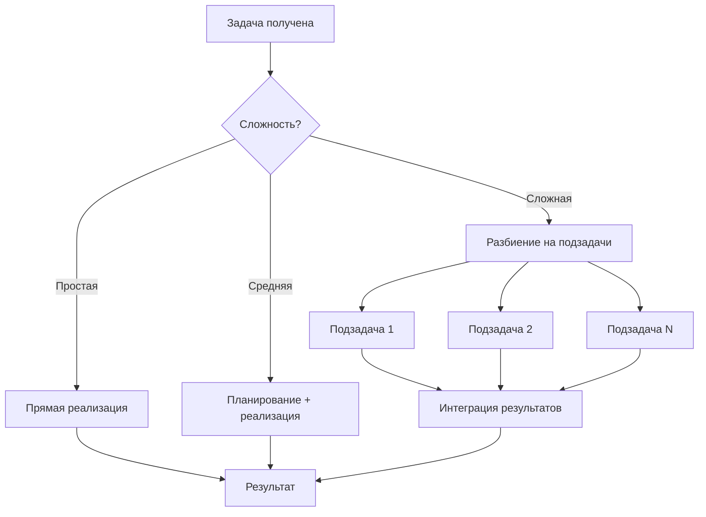
```mermaid
flowchart TD
    A[Задача получена] --> B{Сложность?}
    B -->|Простая| C[Прямая реализация]
    B -->|Средняя| D[Планирование + реализация]
    B -->|Сложная| E[Разбиение на подзадачи]
    E --> F[Подзадача 1]
    E --> G[Подзадача 2]
    E --> H[Подзадача N]
    F --> I[Интеграция результатов]
    G --> I
    H --> I
    C --> J[Результат]
    D --> J
    I --> J
```

---

## Обработка больших файлов

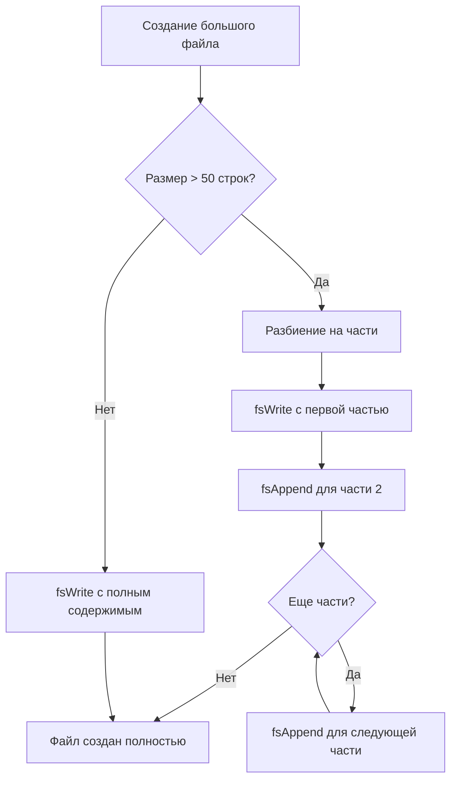
```mermaid
flowchart TD
    A[Создание большого файла] --> B{Размер > 50 строк?}
    B -->|Нет| C[fsWrite с полным содержимым]
    B -->|Да| D[Разбиение на части]
    D --> E[fsWrite с первой частью]
    E --> F[fsAppend для части 2]
    F --> G{Еще части?}
    G -->|Да| H[fsAppend для следующей части]
    H --> G
    G -->|Нет| I[Файл создан полностью]
    C --> I
```

---

## Использование инструментов

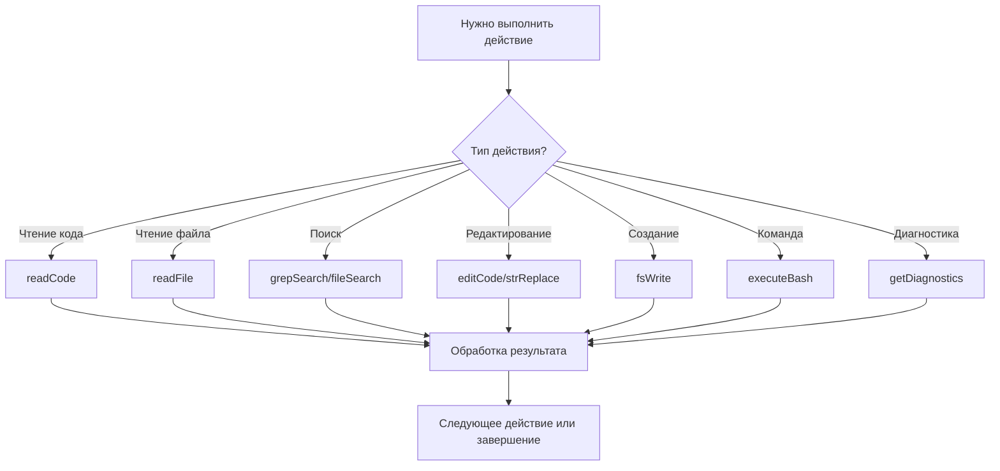
```mermaid
flowchart TD
    A[Нужно выполнить действие] --> B{Тип действия?}
    B -->|Чтение кода| C[readCode]
    B -->|Чтение файла| D[readFile]
    B -->|Поиск| E[grepSearch/fileSearch]
    B -->|Редактирование| F[editCode/strReplace]
    B -->|Создание| G[fsWrite]
    B -->|Команда| H[executeBash]
    B -->|Диагностика| I[getDiagnostics]
    C --> J[Обработка результата]
    D --> J
    E --> J
    F --> J
    G --> J
    H --> J
    I --> J
    J --> K[Следующее действие или завершение]
```

---

## Сценарий: Создание компонента с тестами

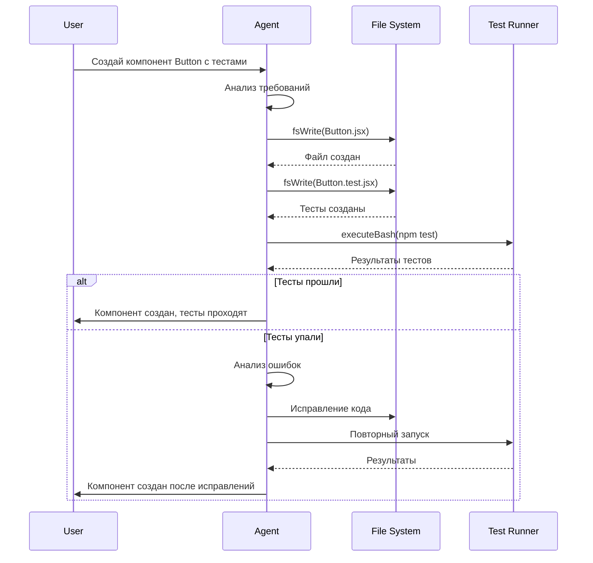
```mermaid
sequenceDiagram
    participant U as User
    participant A as Agent
    participant FS as File System
    participant Test as Test Runner

    U->>A: Создай компонент Button с тестами
    A->>A: Анализ требований
    A->>FS: fsWrite(Button.jsx)
    FS-->>A: Файл создан
    A->>FS: fsWrite(Button.test.jsx)
    FS-->>A: Тесты созданы
    A->>Test: executeBash(npm test)
    Test-->>A: Результаты тестов
    alt Тесты прошли
        A->>U: Компонент создан, тесты проходят
    else Тесты упали
        A->>A: Анализ ошибок
        A->>FS: Исправление кода
        A->>Test: Повторный запуск
        Test-->>A: Результаты
        A->>U: Компонент создан после исправлений
    end
```

---

## Сценарий: Рефакторинг с переименованием

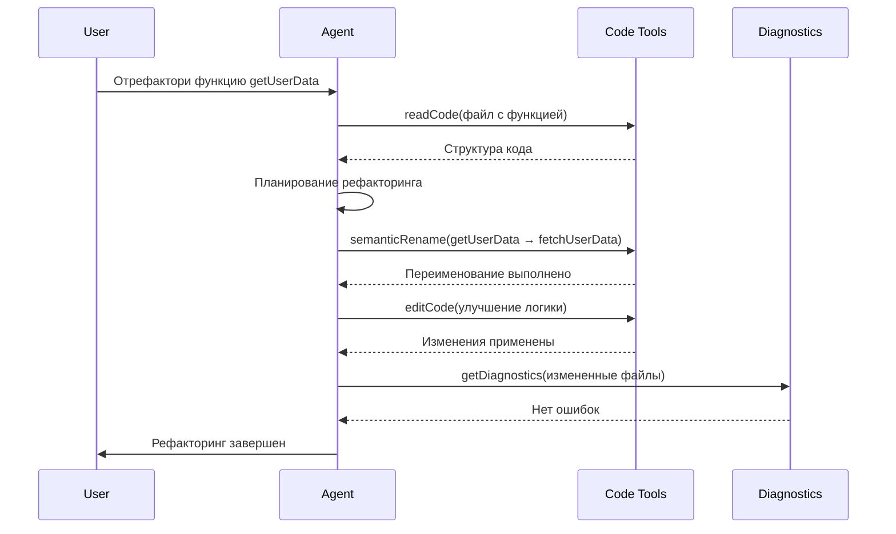
```mermaid
sequenceDiagram
    participant U as User
    participant A as Agent
    participant Code as Code Tools
    participant Diag as Diagnostics

    U->>A: Отрефактори функцию getUserData
    A->>Code: readCode(файл с функцией)
    Code-->>A: Структура кода
    A->>A: Планирование рефакторинга
    A->>Code: semanticRename(getUserData → fetchUserData)
    Code-->>A: Переименование выполнено
    A->>Code: editCode(улучшение логики)
    Code-->>A: Изменения применены
    A->>Diag: getDiagnostics(измененные файлы)
    Diag-->>A: Нет ошибок
    A->>U: Рефакторинг завершен
```

---

## Сценарий: Установка и настройка инструмента

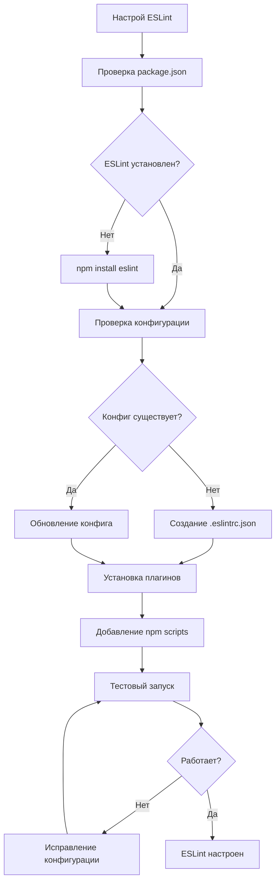
```mermaid
flowchart TD
    A[Настрой ESLint] --> B[Проверка package.json]
    B --> C{ESLint установлен?}
    C -->|Нет| D[npm install eslint]
    C -->|Да| E[Проверка конфигурации]
    D --> E
    E --> F{Конфиг существует?}
    F -->|Нет| G[Создание .eslintrc.json]
    F -->|Да| H[Обновление конфига]
    G --> I[Установка плагинов]
    H --> I
    I --> J[Добавление npm scripts]
    J --> K[Тестовый запуск]
    K --> L{Работает?}
    L -->|Нет| M[Исправление конфигурации]
    M --> K
    L -->|Да| N[ESLint настроен]
```

---

## Обработка множественных файлов

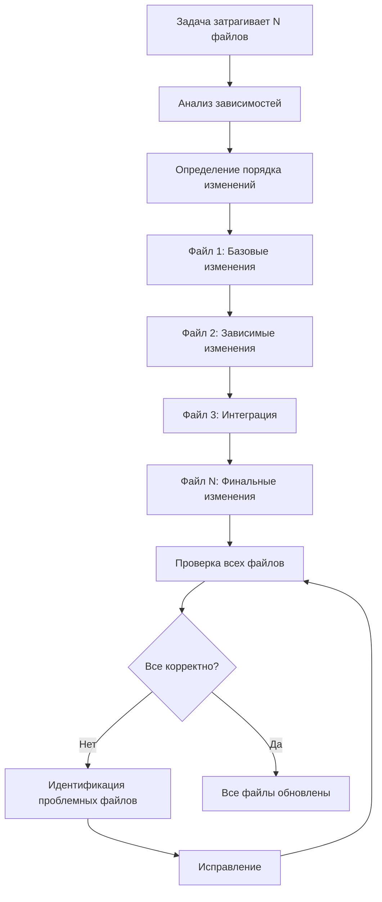
```mermaid
flowchart TD
    A[Задача затрагивает N файлов] --> B[Анализ зависимостей]
    B --> C[Определение порядка изменений]
    C --> D[Файл 1: Базовые изменения]
    D --> E[Файл 2: Зависимые изменения]
    E --> F[Файл 3: Интеграция]
    F --> G[Файл N: Финальные изменения]
    G --> H[Проверка всех файлов]
    H --> I{Все корректно?}
    I -->|Нет| J[Идентификация проблемных файлов]
    J --> K[Исправление]
    K --> H
    I -->|Да| L[Все файлы обновлены]
```

---

## Итеративное выполнение

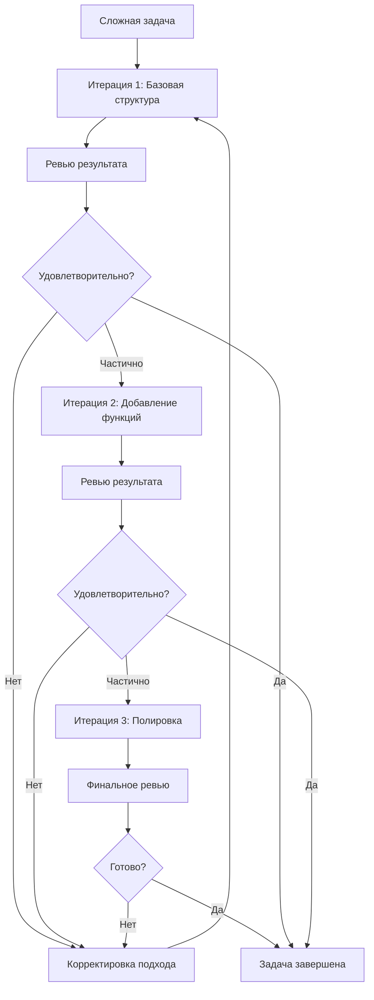
```mermaid
flowchart TD
    A[Сложная задача] --> B[Итерация 1: Базовая структура]
    B --> C[Ревью результата]
    C --> D{Удовлетворительно?}
    D -->|Частично| E[Итерация 2: Добавление функций]
    D -->|Нет| F[Корректировка подхода]
    F --> B
    E --> G[Ревью результата]
    G --> H{Удовлетворительно?}
    H -->|Частично| I[Итерация 3: Полировка]
    H -->|Нет| F
    I --> J[Финальное ревью]
    J --> K{Готово?}
    K -->|Нет| F
    K -->|Да| L[Задача завершена]
    D -->|Да| L
    H -->|Да| L
```

---

## Взаимодействие с другими агентами

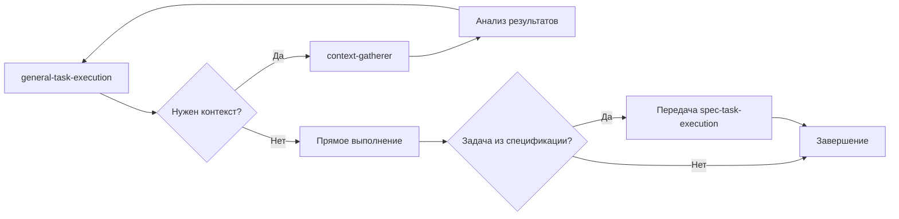
```mermaid
flowchart LR
    A[general-task-execution] --> B{Нужен контекст?}
    B -->|Да| C[context-gatherer]
    C --> D[Анализ результатов]
    D --> A
    B -->|Нет| E[Прямое выполнение]
    E --> F{Задача из спецификации?}
    F -->|Да| G[Передача spec-task-execution]
    F -->|Нет| H[Завершение]
    G --> H
```

---

## Типы задач и подходы

```mermaid
mindmap
  root((general-task-execution))
    Создание
      Новые файлы
      Компоненты
      Модули
      Конфигурации
    Модификация
      Редактирование кода
      Рефакторинг
      Оптимизация
      Исправление багов
    Анализ
      Code review
      Performance analysis
      Dependency check
      Security audit
    Тестирование
      Unit tests
      Integration tests
      E2E tests
      Benchmarks
    Настройка
      Dev tools
      Build configs
      CI/CD
      Linters
```

---

## Принятие решений по инструментам

```mermaid
flowchart TD
    A[Нужно изменить код] --> B{Знаю точное место?}
    B -->|Да| C{Тип изменения?}
    B -->|Нет| D[grepSearch для поиска]
    D --> C
    C -->|Структурное| E[editCode]
    C -->|Простая замена| F[strReplace]
    C -->|Переименование| G[semanticRename]
    C -->|Перемещение файла| H[smartRelocate]
    E --> I[Применение]
    F --> I
    G --> I
    H --> I
    I --> J[getDiagnostics]
    J --> K{Ошибки?}
    K -->|Да| L[Исправление]
    L --> I
    K -->|Нет| M[Готово]
```
