# Spec Task Execution Agent - Workflow Diagrams

## Main Execution Flow

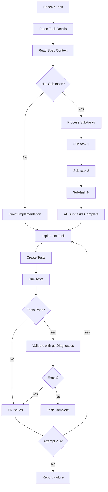

---

## Sub-task Processing

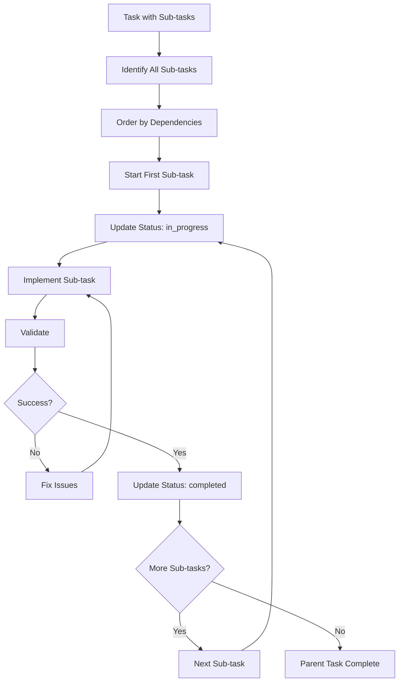

---

## Property-Based Testing Flow

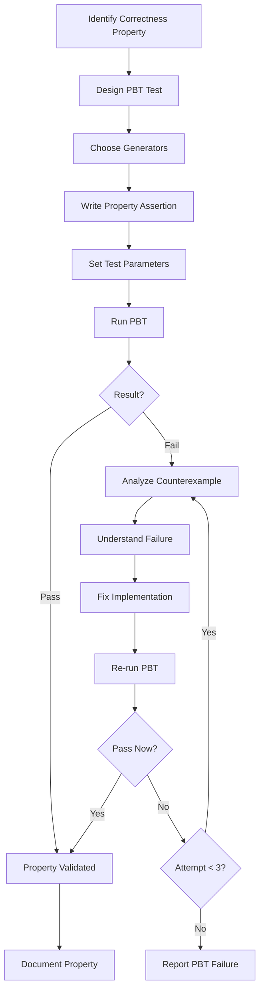

---

## Bugfix Exploration Test (Task 1)

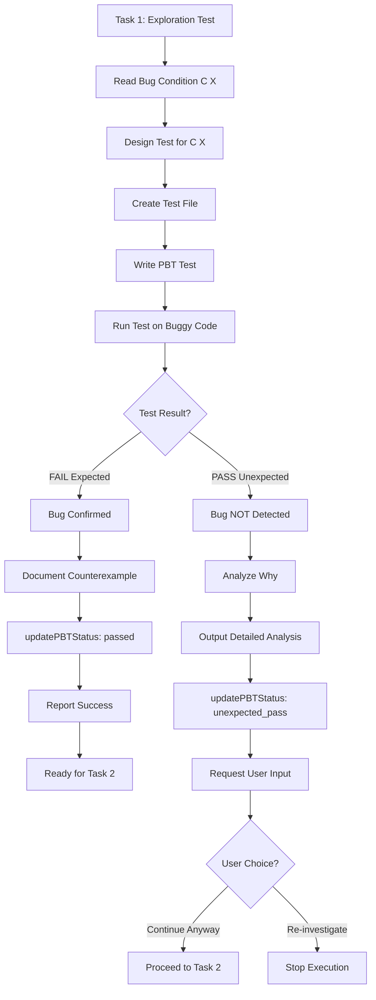

---

## Test Failure Recovery

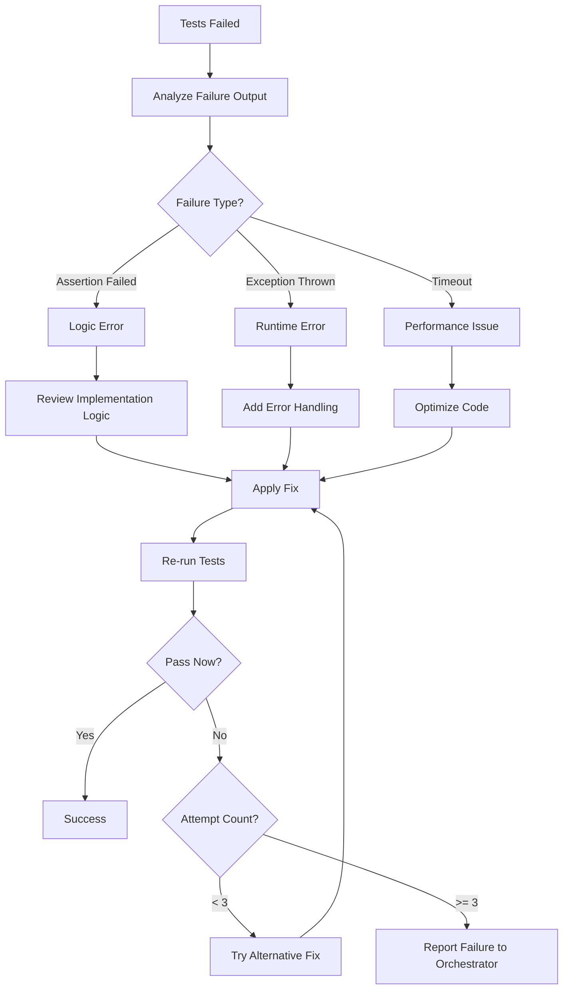

---

## Implementation with Validation

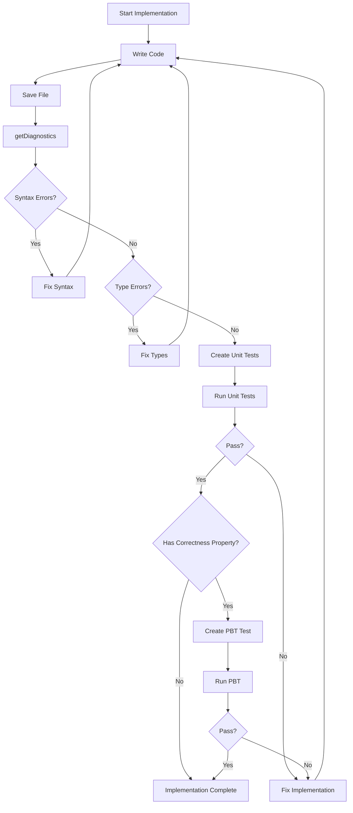

---

## Task Status Lifecycle

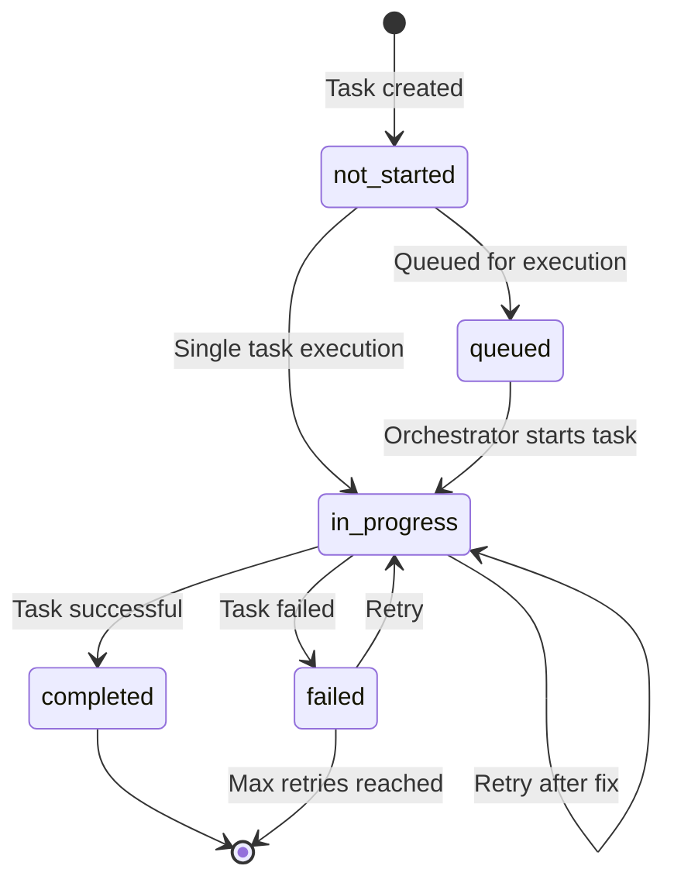

---

## Dependency Installation Flow

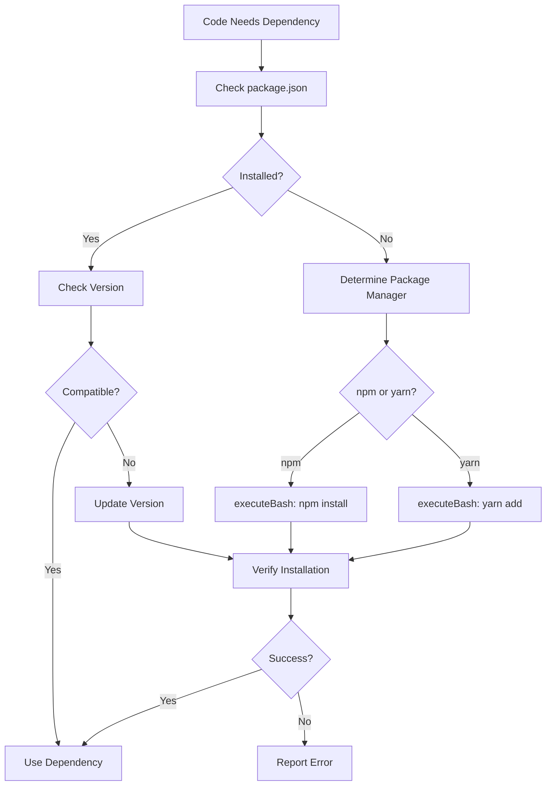

---

## Integration Test Flow

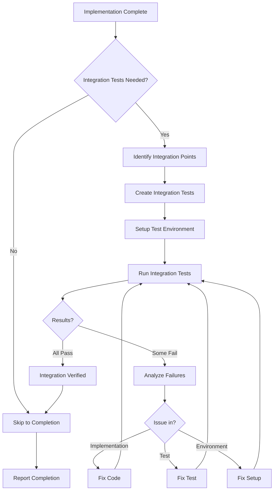

---

## Real Scenario: Implement Login Form

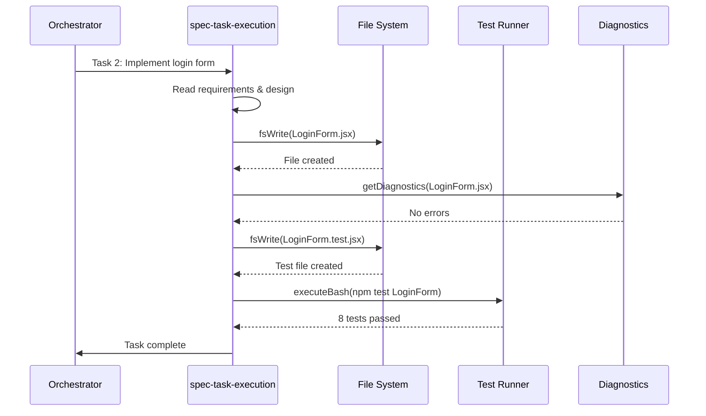

---

## Real Scenario: Bugfix with Exploration Test

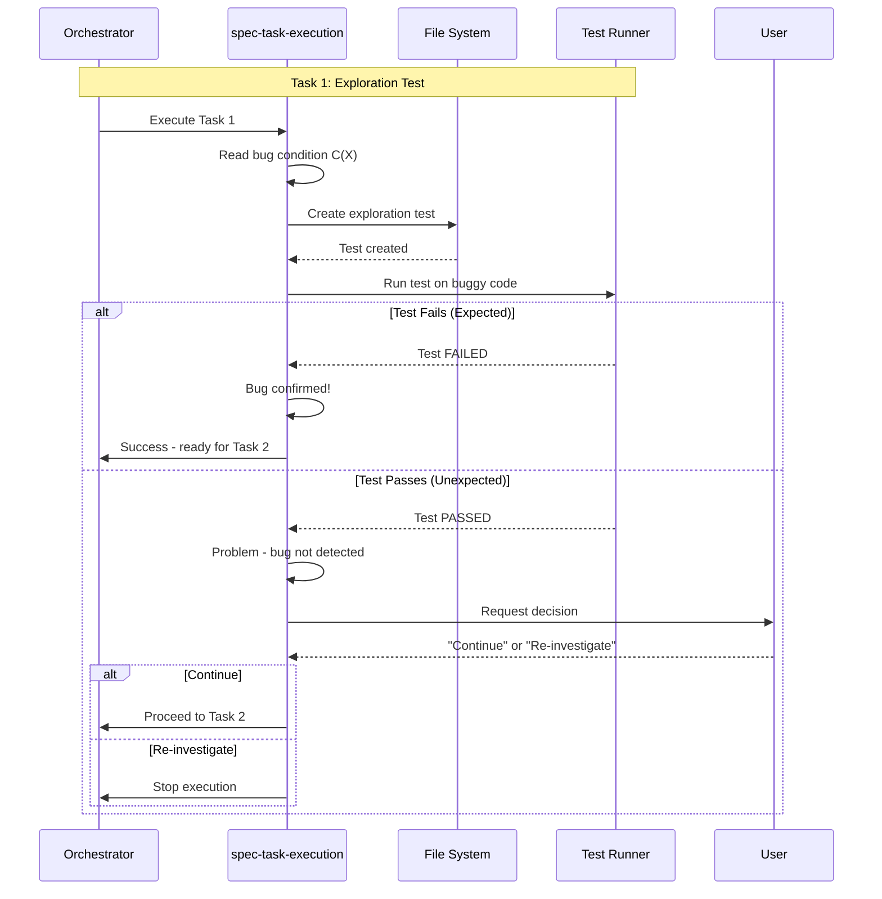

---

## Multi-File Implementation

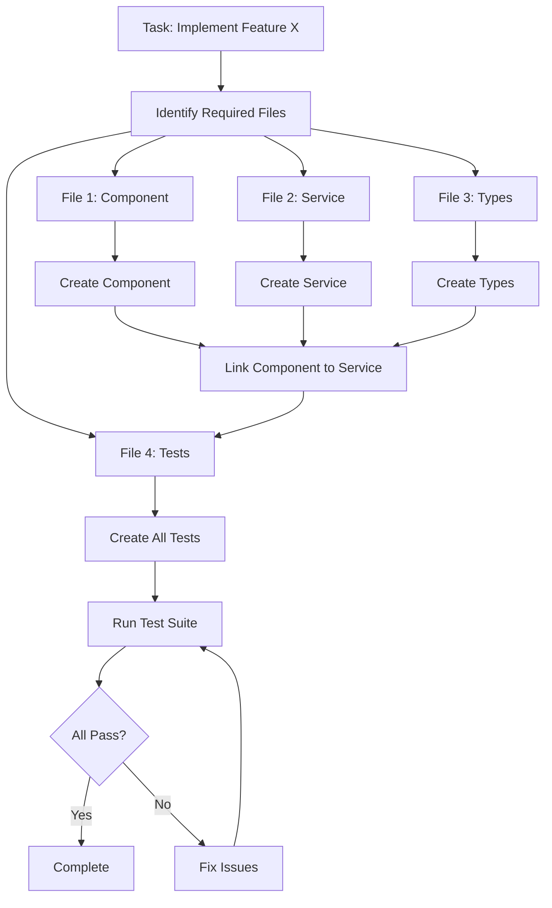
