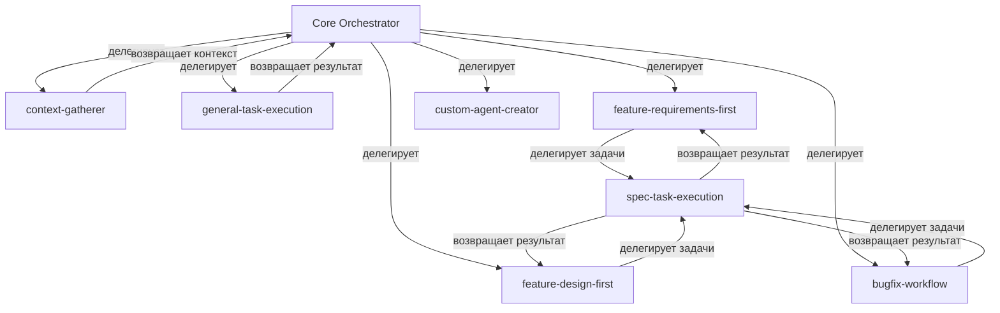

# Kiro Agent Prompts System

## Архитектура системы промптов

Система состоит из центрального ядра (Core Orchestrator) и специализированных агентов, каждый со своим промптом.

---

## Структура

```
prompts/
├── README.md (этот файл)
├── core-orchestrator/
│   ├── prompt.md (главный промпт ядра)
│   └── rules.md (правила оркестрации)
├── general-task-execution/
│   ├── prompt.md (промпт агента)
│   └── examples.md (примеры)
├── context-gatherer/
│   ├── prompt.md
│   └── examples.md
├── spec-task-execution/
│   ├── prompt.md
│   └── examples.md
├── custom-agent-creator/
│   ├── prompt.md
│   └── examples.md
├── feature-requirements-first-workflow/
│   ├── prompt.md
│   └── examples.md
├── feature-design-first-workflow/
│   ├── prompt.md
│   └── examples.md
└── bugfix-workflow/
    ├── prompt.md
    └── examples.md
```

---

## Принципы дизайна промптов

### 1. Модульность
Каждый промпт - независимый модуль с четкой ответственностью

### 2. Композируемость
Промпты могут вызывать друг друга через стандартный интерфейс

### 3. Контекстная изоляция
Каждый агент работает только со своим контекстом

### 4. Стандартизация
Единый формат входов/выходов для всех агентов

---

## Протокол взаимодействия

### Формат вызова агента

```json
{
  "agent": "agent-name",
  "phase": "phase-name",
  "context": {
    "task": "описание задачи",
    "files": ["список релевантных файлов"],
    "constraints": ["ограничения"],
    "metadata": {}
  }
}
```

### Формат ответа агента

```json
{
  "status": "success | failed | partial",
  "result": {
    "filesCreated": [],
    "filesModified": [],
    "output": "результат работы"
  },
  "nextAction": {
    "agent": "следующий агент",
    "phase": "фаза",
    "context": {}
  }
}
```

---

## Иерархия агентов



---

## Роли промптов

### Core Orchestrator (Ядро)
- Первая точка контакта с пользователем
- Анализ намерений пользователя
- Выбор правильного агента
- Управление жизненным циклом задачи
- Агрегация результатов

### Specialized Agents (Специализированные агенты)
- Фокус на конкретной задаче
- Автономное выполнение
- Возврат структурированных результатов
- Минимальная связанность с другими агентами

---

## Потоки данных

### Поток 1: Простая задача
```
User → Core → general-task-execution → Core → User
```

### Поток 2: Создание спецификации
```
User → Core → [выбор workflow] → feature-*-workflow → Core → User
```

### Поток 3: Выполнение задач спецификации
```
User → Core → spec-task-execution → Core → User
```

### Поток 4: Сложная задача с контекстом
```
User → Core → context-gatherer → Core → general-task-execution → Core → User
```

---

## Стандарты промптов

### Обязательные секции в каждом промпте

1. **Identity**: Кто этот агент и его роль
2. **Capabilities**: Что агент может делать
3. **Input Format**: Формат входных данных
4. **Output Format**: Формат выходных данных
5. **Rules**: Правила поведения
6. **Examples**: Примеры использования
7. **Error Handling**: Обработка ошибок
8. **Integration**: Взаимодействие с другими агентами

### Стиль написания

- Четкие, недвусмысленные инструкции
- Конкретные примеры
- Явные ограничения
- Проверяемые условия

---

## Версионирование

Каждый промпт имеет версию:
```markdown
# Agent Name
Version: 1.0.0
Last Updated: 2026-03-10
```

---

## Следующие шаги

Создание промптов для каждого агента в соответствующих папках.
