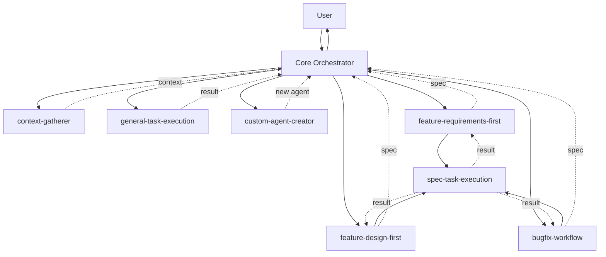
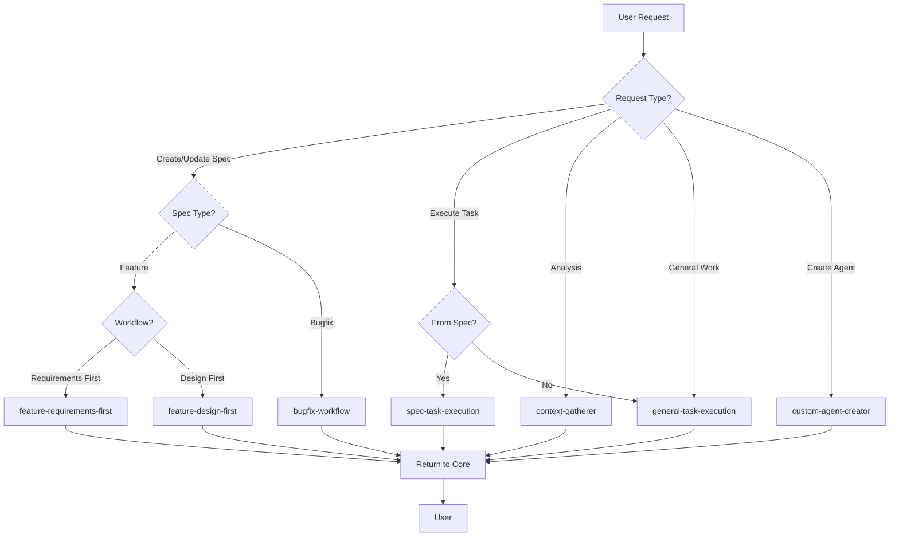
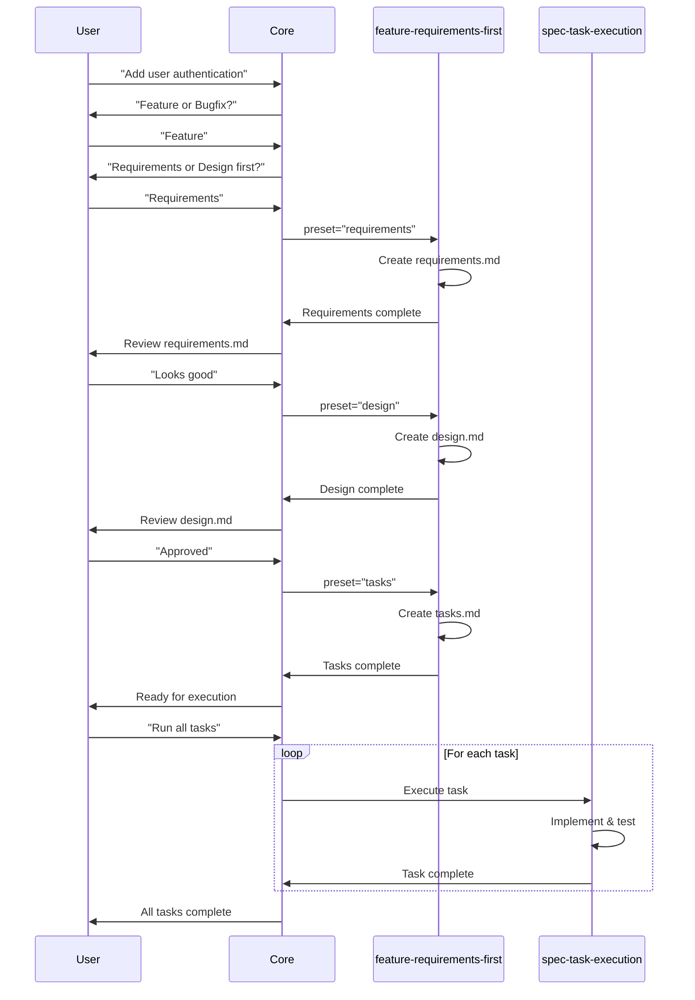
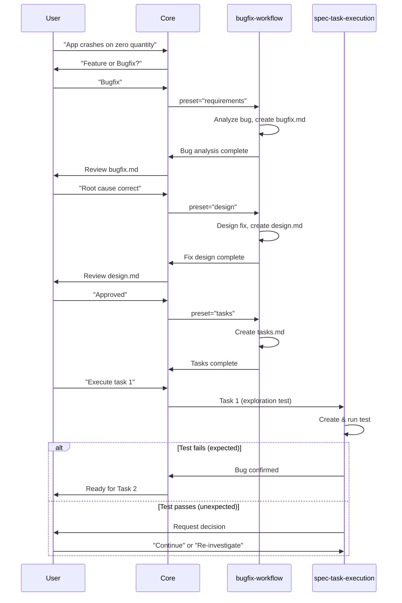

# Kiro Agent System - Complete Overview

**Version**: 1.0.0  
**Last Updated**: 2026-03-10

---

## System Architecture



---

## Agent Hierarchy

### Tier 1: Core Orchestrator
- **Role**: Master coordinator
- **Responsibility**: Route requests, manage workflows
- **Calls**: All other agents
- **Called by**: User (indirectly)

### Tier 2: Workflow Agents
- **feature-requirements-first-workflow**
- **feature-design-first-workflow**
- **bugfix-workflow**
- **Role**: Create specifications
- **Calls**: spec-task-execution
- **Called by**: Core orchestrator

### Tier 3: Execution Agents
- **spec-task-execution**: Execute spec tasks
- **general-task-execution**: Execute general tasks
- **context-gatherer**: Analyze codebase
- **custom-agent-creator**: Create new agents
- **Role**: Perform actual work
- **Calls**: None (leaf nodes)
- **Called by**: Core or workflow agents

---

## Communication Protocol

### Standard Message Format

**Request to Agent**:
```json
{
  "name": "agent-identifier",
  "preset": "phase-name",
  "prompt": "detailed task with context",
  "explanation": "why this agent"
}
```

**Response from Agent**:
```json
{
  "status": "success | failed | partial",
  "result": {
    "filesCreated": [],
    "filesModified": [],
    "output": "description"
  },
  "nextAction": {
    "agent": "next-agent",
    "phase": "next-phase",
    "context": {}
  }
}
```

---

## Decision Flow

### User Request → Agent Selection



---

## Workflow Sequences

### Feature Requirements-First



---

### Bugfix Workflow



---

## Agent Responsibilities Matrix

| Agent | Create Files | Modify Code | Run Tests | Analyze Code | User Interaction |
|-------|-------------|-------------|-----------|--------------|------------------|
| core-orchestrator | ❌ | ❌ | ❌ | ❌ | ✅ |
| context-gatherer | ❌ | ❌ | ❌ | ✅ | ❌ |
| general-task-execution | ✅ | ✅ | ✅ | ✅ | ❌ |
| spec-task-execution | ✅ | ✅ | ✅ | ✅ | ❌ |
| feature-requirements-first | ✅ (specs) | ❌ | ❌ | ❌ | ✅ (approval) |
| feature-design-first | ✅ (specs) | ❌ | ❌ | ❌ | ✅ (approval) |
| bugfix-workflow | ✅ (specs) | ❌ | ❌ | ✅ (bug) | ✅ (approval) |
| custom-agent-creator | ✅ (agent files) | ❌ | ❌ | ❌ | ❌ |

---

## Tool Access Matrix

| Tool Category | Core | CG | GTE | STE | FRF | FDF | BF | CAC |
|--------------|------|----|----|-----|-----|-----|----|----|
| File Read | ✅ | ✅ | ✅ | ✅ | ✅ | ✅ | ✅ | ✅ |
| File Write | ❌ | ❌ | ✅ | ✅ | ✅ | ✅ | ✅ | ✅ |
| Code Edit | ❌ | ❌ | ✅ | ✅ | ❌ | ❌ | ❌ | ❌ |
| Shell Exec | ❌ | ❌ | ✅ | ✅ | ❌ | ❌ | ❌ | ❌ |
| Diagnostics | ❌ | ❌ | ✅ | ✅ | ❌ | ❌ | ❌ | ❌ |
| Search | ✅ | ✅ | ✅ | ✅ | ✅ | ✅ | ✅ | ✅ |
| User Input | ✅ | ❌ | ❌ | ✅* | ✅ | ✅ | ✅ | ❌ |
| Sub-Agent | ✅ | ❌ | ❌ | ❌ | ✅** | ✅** | ✅** | ❌ |

*Only for bugfix exploration test unexpected pass  
**Only to call spec-task-execution

---

## State Management

### Core Orchestrator State

```javascript
{
  currentSpec: {
    name: "feature-name",
    type: "feature | bugfix",
    workflow: "requirements-first | design-first",
    phase: "requirements | design | tasks",
    filesCreated: [],
    approvals: []
  },
  activeAgent: "agent-name",
  history: []
}
```

### Workflow Agent State

```javascript
{
  specPath: ".kiro/specs/feature-name/",
  currentPhase: "requirements | design | tasks",
  documentsCreated: [],
  userApprovals: [],
  readyForNextPhase: boolean
}
```

---

## File System Structure

### Spec Files

```
.kiro/specs/{feature-name}/
├── .config.kiro              # Metadata
├── requirements.md           # Requirements (feature)
├── bugfix.md                 # Bug analysis (bugfix)
├── design.md                 # Technical design
└── tasks.md                  # Implementation tasks
```

### Agent Files

```
.kiro/agents/{agent-name}/
├── config.json               # Agent configuration
├── prompt.md                 # System prompt
├── rules.md                  # Detailed rules
├── examples.md               # Usage examples
└── README.md                 # Documentation
```

### Prompt Files (This System)

```
prompts/
├── README.md                 # System overview
├── SYSTEM_OVERVIEW.md        # This file
├── core-orchestrator/
│   ├── prompt.md
│   └── rules.md
├── general-task-execution/
│   ├── prompt.md
│   └── examples.md
├── context-gatherer/
│   ├── prompt.md
│   └── examples.md
├── spec-task-execution/
│   └── prompt.md
├── feature-requirements-first-workflow/
│   └── prompt.md
├── feature-design-first-workflow/
│   └── prompt.md
├── bugfix-workflow/
│   └── prompt.md
└── custom-agent-creator/
    └── prompt.md
```

---

## Integration Points

### Core ↔ Workflow Agents

**Core sends**:
- User request
- Feature name
- Spec type
- Workflow type
- Phase to execute

**Workflow returns**:
- Created files
- Status
- Ready for next phase
- Needs user approval

---

### Workflow ↔ Execution Agents

**Workflow sends**:
- Task details
- Spec context
- Requirements/design excerpts

**Execution returns**:
- Implementation status
- Files created/modified
- Test results
- Completion status

---

### Core ↔ User

**Core presents**:
- Choices (spec type, workflow type)
- Documents for review
- Progress updates
- Final results

**User provides**:
- Choices
- Approvals
- Feedback
- Continuation signals

---

## Error Handling Strategy

### Agent Failure

```
Agent fails → Core catches error → Inform user → Offer alternatives
```

### Invalid Input

```
Invalid input → Core validates → Re-prompt user → Accept variations
```

### Missing Prerequisites

```
Missing files → Core detects → Auto-create → Proceed
```

### Test Failures

```
Tests fail → Agent retries (max 3) → Still fails → Report to Core → User decision
```

---

## Quality Assurance

### Pre-Delegation Checklist

- [ ] Correct agent selected
- [ ] Appropriate preset set
- [ ] Complete context provided
- [ ] Prerequisites validated
- [ ] Clear explanation given

### Post-Completion Checklist

- [ ] Results received
- [ ] Files created correctly
- [ ] User informed
- [ ] Next steps clear
- [ ] State updated

---

## Performance Considerations

### Minimize Latency

- Batch related operations
- Parallel independent tasks
- Efficient tool usage
- Minimal file reads

### Optimize Context

- Pass only relevant information
- Avoid redundant data
- Structure clearly
- Keep focused

### Resource Management

- Don't start long-running processes
- Clean up temporary files
- Manage memory efficiently
- Timeout appropriately

---

## Security Considerations

### File System

- Validate all paths
- Stay within workspace
- No arbitrary file access
- Respect .gitignore

### Code Execution

- No untrusted code execution
- Validate shell commands
- Sanitize inputs
- Limit permissions

### Data Privacy

- No PII in logs
- Sanitize error messages
- Respect user data
- Secure credentials

---

## Versioning and Updates

### Prompt Versions

Each prompt has version number:
```markdown
**Version**: 1.0.0
**Last Updated**: 2026-03-10
```

### Compatibility

- Backward compatible changes: Patch version
- New features: Minor version
- Breaking changes: Major version

### Update Process

1. Update prompt file
2. Increment version
3. Update last modified date
4. Document changes
5. Test compatibility

---

## Monitoring and Debugging

### Logging

Each agent should log:
- Invocation details
- Key decisions
- Errors encountered
- Results produced

### Debugging

When issues occur:
1. Check agent selection
2. Verify context passed
3. Review agent logs
4. Test in isolation
5. Validate prerequisites

---

## Future Enhancements

### Planned Features

- Agent performance metrics
- Automatic agent selection
- Learning from user feedback
- Agent composition patterns
- Advanced error recovery

### Extensibility

System designed for:
- Easy agent addition
- Custom workflows
- Tool extensions
- Integration plugins

---

## Summary

This system provides:
- **Modular architecture**: Independent, composable agents
- **Clear responsibilities**: Each agent has specific role
- **Standard protocols**: Consistent communication
- **Quality focus**: Built-in validation and testing
- **User-centric**: Transparent, controllable workflows
- **Extensible**: Easy to add new agents and capabilities

The core orchestrator manages everything, workflow agents create specifications, and execution agents do the work. All agents follow standard protocols and can work together seamlessly.
